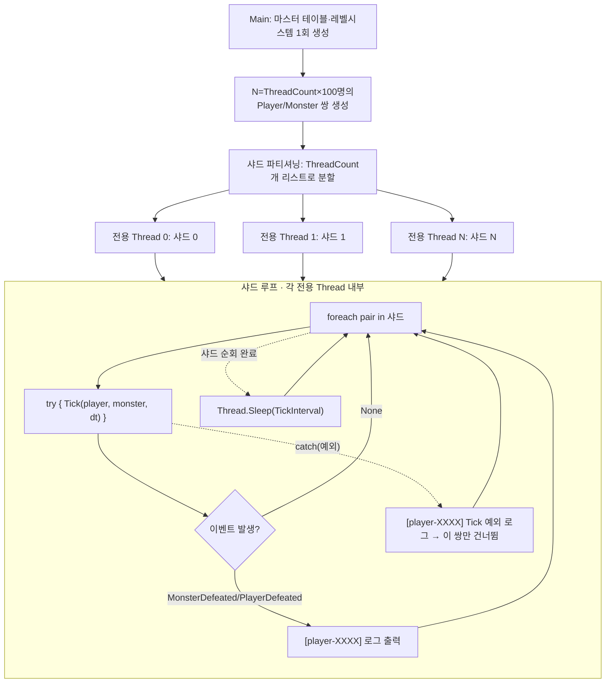

# 다중 플레이어 배틀 — 스레드 샤딩 모델

## 1. 배경 및 목적

`GameServer/Systems/BattleLoop.cs`는 지금까지 **단일 Player vs 단일 Monster** 라운드제 무한 루프로
스코프가 좁혀져 있었다(`plan/battle_system_0705.md` §8: "멀티플레이 접점은 이번 설계 범위 밖"으로
명시). `GameServer/Main.cs`도 이 가정 위에서 플레이어 1명 · 몬스터 1마리를 만들어 `BattleLoop.RunAsync`
하나만 돌리는 데모다.

이번 사이클의 목적은 **서버에 다수의 플레이어가 동시 접속해 각자 독립적으로 전투를 진행하는 상황**을
시뮬레이션하는 것이다. 아직 실제 네트워크 세션 계층은 없으므로(TCP/WebSocket 리스너 등 전무 —
grep 결과 확인됨), 이번 범위는 `Main.cs` 데모를 확장해 **스레드당 100명**, 스레드 수는 조정 가능한
상수로 노출하는 스레드 샤딩(sharding) 모델을 도입하는 것으로 한정한다. 플레이어 간 상호작용
(파티 co-op, PvP)은 없다 — 완전히 독립된 전투다.

## 2. 설계 결정

| 항목 | 채택안 | 대안 | 사유 |
|------|--------|------|------|
| 멀티플레이 형태 | **서버 동시 접속(독립 전투)** | 파티 co-op / PvP | 플레이어끼리 상호작용 없이 각자 자기 몬스터와 싸우는 idle RPG 서버의 자연스러운 확장. 파티/PvP는 새 도메인 개념(공유 대상, 상호 데미지)이 필요해 별도 사이클 대상 |
| 관리 범위 | **고정 데모 리스트**(`Main.cs` 확장) | 런타임 추가/제거 가능한 `BattlePlayerManager` | 아직 네트워크 접속/해제 이벤트가 없어 동적 관리자가 연결될 대상이 없음. 도메인 로직 검증이 이번 사이클의 목적이므로 최소 범위로 한정 |
| 규모 | **스레드 수 사용자 지정(`Main.cs` 상수), 스레드당 100명 고정** | 스레드 4개 고정 / CPU 코어 수 기반 | 실행 환경마다 원하는 부하를 실험할 수 있도록 상수로 노출. 스레드당 인원(100)은 사용자 요청 그대로 고정 |
| 실행 모델 | **전용 `Thread` + 동기 순회 틱 루프** | Task.Run(LongRunning) + 비동기 순회 | 전용 스레드 안에서는 `Thread.Sleep` 동기 대기가 스레드 풀을 뺏지 않으므로 문제없다. `BattleLoop.RunAsync`(Task 기반)는 손대지 않고 그대로 남겨 기존 테스트·용례를 보존, 이번 데모는 `Tick`을 직접 호출하는 새 경로를 씀 |
| 동시성 안전 | **`BattleManager.Random` → `Random.Shared`** | `BattleLoop`마다 전용 `BattleManager` 인스턴스 주입 | `Random.Shared`(.NET 6+)가 이미 스레드 안전을 보장하므로 최소 변경으로 해결. 결정적 시드가 필요한 기존 테스트는 `internal BattleManager(Random random)` 생성자 경로를 그대로 사용해 영향 없음 |
| 로깅 | **주요 이벤트만 로깅**(처치/사망), 플레이어 ID 프리픽스 | 매 틱 HP 상태 로그 / 샤드별 주기적 요약 통계 | 스레드당 100명 규모에서 매 틱 HP 로그를 다 찍으면 콘솔이 초당 수백 줄로 넘친다. 개별 플레이어 추적이 필요하므로(디버깅 목적) 요약 통계보다 이벤트 로그를 선택하되, 빈도 문제는 이벤트만 걸러 해결 |

## 3. 컴포넌트 구조

```
GameServer/
├─ Systems/
│  ├─ BattleManager.cs   — 수정. private readonly Random _random를 기본 경로에서 Random.Shared로 교체.
│  │                        internal BattleManager(Random random) 시드 주입 생성자는 유지(기존 테스트 영향 없음).
│  └─ BattleLoop.cs      — 변경 없음. Tick(internal)/RunAsync(public) 그대로 유지.
│                           이번 데모는 Tick을 직접 호출하는 새 경로를 쓰고, RunAsync/LogTick은 건드리지 않는다
│                           (RunAsync 전용 경로로 남고 다른 용례·테스트에 계속 쓰일 수 있음).
└─ Main.cs               — 전면 수정. 기존 "플레이어 1명 vs 몬스터 1마리" 데모를 아래로 교체:
                            1) ThreadCount(상수, 조정 가능) × PlayersPerThread(100 고정)만큼
                               Player/Monster 쌍 생성 (PlayerFactory/MonsterFactory 재사용)
                            2) 쌍들을 ThreadCount개의 샤드로 파티셔닝
                            3) 샤드마다 전용 Thread(IsBackground = true) 생성 —
                               내부에서 무한 루프: foreach 샤드 순회 → Tick 직접 호출(try/catch로
                               쌍 단위 격리) → 이벤트 발생 시만 [player-XXXX] 프리픽스로 콘솔 로그 →
                               Thread.Sleep(TickInterval)
                            4) 메인 스레드는 await Task.Delay(Timeout.Infinite)로 대기(Ctrl+C 종료)
```

**공유 vs 독립 인스턴스:**
- **공유(읽기 전용 조회만 하므로 안전):** `MonsterTable`/`EquipmentTable`/`LevelTable`
  (`CreateDefault()`로 1회 생성 후 `GetById`만 호출), `PlayerLevelSystem`(내부적으로 위 테이블을
  참조), `BattleLoop` 인스턴스 자체(내부 상태 없음, `Tick`은 인자로 받은 Player/Monster만 변경).
- **플레이어마다 독립:** `Player`/`Monster` 인스턴스. `Entity`/`BattleLoop`는 스레드 안전하지 않다고
  문서화되어 있으므로(동일 인스턴스를 여러 스레드에서 동시에 `Tick`하면 안 됨), 절대 공유하지 않는다.

## 4. 데이터 흐름 및 동시성



**동시 접근 지점과 안전성:**
- `BattleManager.Instance.CalcFinalDamage`: 여러 샤드 스레드가 동시에 호출하지만 `Random.Shared`
  덕분에 스레드 안전. 나머지는 인자로 받은 Player/Monster의 `FinalStats`만 읽는 순수 계산.
- `PlayerLevelSystem.CheckLevelUp`: 내부 `LevelTable`(`MasterDataTable<TKey,T>`)은 생성 시 1회
  `Dictionary`를 구축한 뒤 조회만 하므로(불변) 동시 읽기 안전. 실제 변경 대상은 호출 인자로 받은
  `Player` 인스턴스뿐 — 그 플레이어를 소유한 스레드만 접근하므로 안전.

## 5. 오류 처리 (핵심 위험)

**발견된 위험:** 전용 `Thread`에서 처리되지 않은 예외가 발생하면, 백그라운드 스레드 여부와 무관하게
.NET 런타임은 **프로세스 전체를 종료**시킨다. 샤드 하나의 플레이어 한 명에서 발생한 예외가 나머지
`(ThreadCount×100 - 1)`명까지 전부 죽이는 결과가 된다 — Task 기반 모델(`Task.WhenAll`이 조용히
멈추는 문제)보다 더 심각한 실패 모드다.

**대응:** 샤드 루프의 `foreach` 안에서 **쌍(pair) 단위로 try/catch**를 감싼다. `Tick` 호출이
예외를 던지면 `[player-XXXX] Tick 예외: {메시지}`를 로그로 남기고 그 쌍만 건너뛰어(다음 틱에도
같은 쌍은 계속 시도됨) 나머지 플레이어·스레드는 영향받지 않도록 한다. 자동 복구·재시작 로직(예:
손상된 플레이어 상태 리셋)은 이번 범위 밖이다.

## 6. 핵심 API 스케치

```csharp
// GameServer/Main.cs (개정 스케치 — 실제 구현은 계획 단계에서 세부 조정)
const int ThreadCount = 4;          // 조정 가능 — 총 플레이어 수 = ThreadCount * PlayersPerThread
const int PlayersPerThread = 100;   // 고정(사용자 요청)
var tickInterval = TimeSpan.FromMilliseconds(500);

var monsterTable = MonsterTable.CreateDefault();
var equipmentTable = EquipmentTable.CreateDefault();
var levelSystem = PlayerLevelSystem.CreateDefault();
var battleLoop = new BattleLoop(levelSystem); // 읽기 전용 조회만 하므로 전 샤드 공유

var shards = Enumerable.Range(0, ThreadCount)
    .Select(t => Enumerable.Range(0, PlayersPerThread)
        .Select(i => t * PlayersPerThread + i)
        .Select(globalIndex => CreatePlayerMonsterPair(globalIndex, levelSystem, monsterTable, equipmentTable))
        .ToList())
    .ToList();

foreach (var shard in shards)
{
    var thread = new Thread(() => RunShard(shard, battleLoop, tickInterval)) { IsBackground = true };
    thread.Start();
}

await Task.Delay(Timeout.Infinite); // Ctrl+C로 종료

void RunShard(List<(Player Player, Monster Monster)> shard, BattleLoop loop, TimeSpan interval)
{
    var deltaTime = (float)interval.TotalSeconds;
    while (true)
    {
        foreach (var (player, monster) in shard)
        {
            try
            {
                var result = loop.Tick(player, monster, deltaTime); // internal — 같은 어셈블리(Main.cs)라 접근 가능
                if (result != BattleTickEvent.None)
                    LogEvent(player.InstanceId, result, player);
            }
            catch (Exception ex)
            {
                Console.WriteLine($"[{player.InstanceId}] Tick 예외: {ex.Message}");
            }
        }
        Thread.Sleep(interval);
    }
}
```

```csharp
// GameServer/Systems/BattleManager.cs (수정 지점)
private BattleManager() : this(Random.Shared) // 기존: new Random()
{
}
```

## 7. 변경 파일 목록

- 수정: `GameServer/Systems/BattleManager.cs` — 기본 생성자가 `Random.Shared`를 사용하도록 변경(1줄).
  `internal BattleManager(Random random)` 시드 주입 생성자는 유지.
- 수정: `GameServer/Main.cs` — 단일 Player-vs-Monster `RunAsync` 데모를 걷어내고, 스레드 샤딩 기반
  다중 플레이어 데모로 교체(플레이어/몬스터 쌍 생성 헬퍼, 샤드 파티셔닝, 전용 Thread 루프, 이벤트
  전용 로깅, try/catch 격리 포함).
- 변경 없음: `GameServer/Systems/BattleLoop.cs`(`Tick`/`RunAsync`/`LogTick` 그대로), 기존
  `tests/GameServer.Tests/Systems/BattleLoopTests.cs`(회귀 없이 그대로 통과해야 함).

## 8. 빌드 검증

```powershell
dotnet build IDLE_RPG.sln
dotnet test tests/GameServer.Tests/GameServer.Tests.csproj
dotnet run --project GameServer/GameServer.csproj
```

**확인 기준:**
- 기존 `GameServer.Tests`(99개, `BattleManager`/`BattleLoop` 관련 테스트 포함) 전부 회귀 없이 통과.
- `Main.cs` 실행 시 여러 `[player-XXXX]` 프리픽스가 붙은 처치/부활 로그가 뒤섞여 출력되고, 몇 초간
  실행해도 프로세스가 죽지 않는 것을 육안으로 확인(의도적으로 예외를 주입해 격리가 동작하는지까지
  확인할지는 구현 단계에서 결정).

## 9. 향후 확장 포인트

- 파티 co-op / PvP: 플레이어 간 상호작용이 필요해지면 별도 설계 사이클 대상.
- 런타임 플레이어 추가/제거(`BattlePlayerManager` 또는 실제 네트워크 세션 계층 도입 시 재검토).
- 샤드별 요약 통계(초당 처치 수 등) 로깅 — 개별 이벤트 로그와 병행하거나 대체할지는 운영 시 관측
  필요에 따라 재검토.
- 예외 격리 이후 손상된 플레이어 상태에 대한 자동 복구/재시작 로직.
- `ThreadCount`/`PlayersPerThread`를 설정 파일이나 커맨드라인 인자로 노출(현재는 소스 상수).
