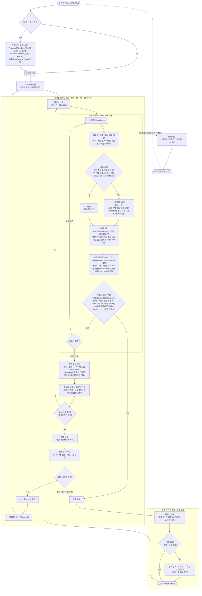

# 전투 플로우 설계 — 하이브리드 모델 (실시간 틱 + 오프라인 수식)

## 1. 배경 및 목적

사용자가 "몬스터 조우 → 전투 → 전리품 획득 → 몬스터 조우"를 큰 흐름으로 하는 mermaid `flowchart`를
제시했다. 다이어그램 자체는 웨이브/보스/실패 분기를 갖춘 실시간 전투 루프를 담고 있었으나,
`IDLE_RPG`가 **방치형(Idle) 서버 게임**이라는 전제와 대조하면 다음이 비어 있었다:

- 오프라인/자동 진행 경로 부재 (방치형의 핵심)
- 전투 연산 모델(실시간 틱 vs 수식) 미정의
- 전투 밖 성장 루프 부재 → 실패 시 무한 루프
- 실패 처리 규칙(강등 vs 부활) 모호, 스킬 자원 게이팅 미정, 다중 대상 미고려

기존 코드(`GameServer/`)에는 이미 `OfflineProgressionManager.ProcessOfflineTime`,
`RewardComponent.GenerateLoot(int killCount)` 같은 **킬수/시간 기반 수식 스텁**과,
`BattleManager.CalcFinalDamage`(구현 완료), `BuffManager.Update(deltaTime)`,
`Entity.Update(deltaTime)` 같은 **실시간 틱 스텁**이 공존한다. 즉 설계 의도 자체가
"온라인=실시간 틱, 오프라인=수식"의 하이브리드였다는 것이 코드에서 드러난다.

이번 사이클의 목적은 사용자 제시 플로우차트를 이 하이브리드 모델에 맞춰 **완성형 다이어그램으로
보강**하고, 구현 전 반드시 확정해야 할 설계 결정(실패 처리, 스킬 자원, 자동전투 여부)을 고정하는
것이다. 실제 Stage/Wave/Boss/Spawner 클래스 구현은 다음 사이클로 미룬다.

## 2. 설계 결정

| 항목 | 채택안 | 대안 | 사유 |
|------|--------|------|------|
| 연산 모델 | **하이브리드**(온라인 실시간 틱 / 오프라인 수식, 동일 파라미터로 정합성 유지) | 완전 실시간 틱만 / 완전 수식만 | 기존 코드가 이미 두 경로(`BattleManager`+`Entity.Update` vs `OfflineProgressionManager`)를 스텁으로 갖고 있어, 한쪽만 채택하면 다른 절반이 죽은 코드가 됨. 온라인 정밀도와 오프라인 서버 부하 절감을 동시에 취함 |
| 실패 처리 | **제자리 부활(코스트 지불)**, 강등 없음 | 이전 스테이지 강등 / 조건별 분기(일반=부활, 보스=재시작) | 방치형에서 강등은 스트레스 요인이 큼. 부활 코스트(골드/쿨다운)로 실패에 비용을 부여하되 진행도는 보존해 재도전 유도 |
| 스킬 자원 | **쿨타임 + 마나** | 쿨타임만 | 자원 게이팅이 있어야 스킬 사용 판단(`t2` 분기)에 의미가 생김. 단, 현재 `StatType` enum에 마나가 없어 후속 스탯 확장 필요(§7) |
| 자동 전투 | **완전 자동**, 유저 개입 없음 | 자동+수동 스킬 발동 옵션 | 온라인/오프라인 결과 정합성을 지키려면 유저 개입 변수를 배제하는 편이 수식과의 대응이 단순함. 액티브 플레이 보상은 후속 사이클 검토 |

## 3. 완성형 다이어그램



### 원본 대비 보강 요약

| # | 원본의 부족한 점 | 완성형에서 보강 |
|---|------------------|-----------------|
| 1 | 오프라인/방치 경로 없음 | 세션 계층 추가: `오프라인 정산(수식)` ↔ `이탈→저장→타이머` |
| 2 | `s2` 행동 주체 불명 | **완전 자동** — `t2` 행동 선택(스킬 vs 평타)을 서버 AI가 결정 |
| 3 | 실패 후 무한 루프(성장 없음) | `GROW` 서브그래프: 부활 코스트 → 성장(강화/투자/업글) → 재도전 |
| 4 | 실시간/수식 모델 미정의 | 하이브리드 명시 + 정합성 원칙(§4) |
| 5 | 시간(Δt) 진행 지점 없음 | `t0 Δt 진행`을 루프 헤드에 고정, 보스전 제한시간 감소 |
| 6 | 단일 대상 가정 | `웨이브 N마리` + 생존 판정을 **전멸 판정**(`c1`/`c2`)으로 |
| 7 | 버프/디버프 관리 없음 | `t5 BuffManager.Update` — 지속시간·DoT 갱신 |
| 8 | 스킬 자원 없음 | **마나** 회복(`t1`)·게이팅(`t2`)·소모(`t3s`) |
| 9 | 보상=골드/경험치만 | 아이템 드롭(`DropTable`) 추가 |
| 10 | 레벨업 vs 등반 혼재 | `r2 레벨업`(캐릭터)과 `b4 등반`(스테이지) 분리 |
| 11 | `s_fail` 강등/부활 OR 애매 | **제자리 부활**로 단일화, 강등 제거 |
| 12 | `\n` 렌더 불가(mermaid는 `<br/>` 필요) | 전부 `<br/>`로 교체 |

**구현 완료 갱신(2026-07-05 TDD 사이클):** 위 표의 `t1`(마나 회복)·`t2`(마나 게이팅)·`t4`(피해량)·
`t5`(버프 갱신, DoT 제외)·`r1`(경험치/골드/아이템 드롭)·오프라인 정산 경로는 실제 코드로 구현되어
`GameServer.Tests`(41개 테스트)로 검증됨. `t3s`의 스킬 발동 루프 자체, `s1/b1/w1/b4`(웨이브·보스·스폰·등반),
DoT는 여전히 다음 사이클 대상.

## 4. 컴포넌트 구조

다이어그램의 각 노드가 요구하는 컴포넌트. **2026-07-05 TDD 사이클에서 스텁 구현이 완료**된 항목은
"구현됨"으로 표시. `BattleLoop`/`Stage`/`Wave`/`MonsterSpawner`/`ReviveCostCalculator`는 여전히
**다음 구현 사이클의 청사진**(실제 파일 아님).

```
GameServer/
├─ Stats/
│  ├─ StatType.cs        — 구현됨. Mana/ManaRegen 추가
│  ├─ BaseStats.cs       — 구현됨. Mana/ManaRegen 필드 추가. ※ operator+는 여전히 미구현
│  │                        스텁(NotImplementedException) — 파이프라인이 필드를 직접 읽어 호출되지
│  │                        않으므로 런타임 영향은 없음(코드리뷰 F9)
│  └─ FinalStats.cs      — 구현됨. MaxMana/CurrentMana/ManaRegen + AttackScaling 필드 추가
│                           (AttackScaling은 코드리뷰 F1 수정으로 추가: 무기 배율을 온라인·오프라인이
│                           동일하게 읽도록 함)
├─ Combat/
│  ├─ BuffManager.cs      — 구현됨. ApplyEffect/RemoveEffect/Update/GetAllActiveModifiers
│  └─ StatusEffect.cs     — 구현됨. Tick/IsExpired/GetModifiers + Modifiers 필드 추가
├─ Entities/
│  ├─ Entity.cs           — 구현됨. TakeDamage/Update/TryConsumeMana/RestoreResources +
│  │                        통합 스탯 집계 파이프라인(UpdateFinalStats, Flat→PercentAdd→PercentMult) +
│  │                        GetAttackScaling 훅(코드리뷰 F1). TakeDamage/TryConsumeMana 음수 값
│  │                        가드 추가(코드리뷰 F5).
│  │                        BaseStats/BaseTraits를 public으로 변경(외부에서 설정할 경로가 없던 gap 해소).
│  │                        ※ Traits.operator+(`Stats/Traits.cs`)도 BaseStats와 동일하게 미구현
│  │                        스텁이나 호출되지 않아 런타임 영향 없음(코드리뷰 F9)
│  ├─ Player.cs           — 구현됨. AddExp/AddGold, GetExtraModifiers(장비 위임),
│  │                        GetAttackScaling(장착 무기 위임, 코드리뷰 F1).
│  │                        기존 UpdateFinalStats 오버라이드(ModType 무시·버프 미반영 버그) 제거
│  └─ Monster.cs          — 구현됨. GetExtraModifiers, MonsterAffixes를 public init으로 변경
├─ Systems/
│  ├─ BattleManager.cs    — 구현 완료(이전 사이클) — 틱 루프에서 t4 호출.
│  │                        코드리뷰 F1로 CalcFinalDamage가 FinalStats.AttackScaling을 자동으로
│  │                        곱하도록 수정, attackScaling 파라미터는 "추가 배율"로 의미 축소
│  ├─ OfflineProgressionManager.cs — 구현됨. 기대 DPS 공식 기반 killCount 환산.
│  │                        코드리뷰 F1(AttackScaling 누락)·F2(음수 offlineSeconds 클램프) 수정
│  ├─ RewardComponent.cs  — 구현됨. GenerateLoot(킬수·드롭테이블 확률 롤), 결정적 RNG 주입 생성자 추가.
│  │                        코드리뷰 F3(음수 killCount 클램프)·F4(MinQty>MaxQty 방어) 수정
│  ├─ LootItem.cs         — 신규(Item 구체 타입 부재로 추가, DropPool과 동일한 보완 패턴)
│  ├─ BattleLoop.cs       (신규 예정) — 온라인 틱 루프 스케줄러 (t0~c2), deltaTime 구동
│  ├─ Stage.cs            (신규 예정) — 스테이지 번호, 웨이브 목록, 보스 조건(N/N), 제한시간
│  ├─ Wave.cs              (신규 예정) — 웨이브당 몬스터 스폰 목록
│  ├─ MonsterSpawner.cs   (신규 예정) — 웨이브/보스 스폰 팩토리
│  └─ ReviveCostCalculator.cs (신규 예정) — 부활 코스트 공식 (§8 미결)
tests/
└─ GameServer.Tests/      — 신규. xUnit, GameServer ProjectReference, InternalsVisibleTo 부여받음
```

**의존 관계:** `BattleLoop`(다음 사이클)가 `BattleManager`(피해량)·`BuffManager`(상태이상)·`Entity`(생사 판정)를
구동하고, 결과를 `RewardComponent`에 위임할 예정. `OfflineProgressionManager`는 `BattleManager`와
동일한 `DefenseConstant`·기대 DPS 파라미터를 공유해 오프라인 수식 결과가 온라인 시뮬레이션과 어긋나지 않도록 한다(구현됨).

## 5. 핵심 API

**`BattleLoop`(다음 사이클 제안, 미구현):**

```csharp
namespace GameServer.Systems;

/// <summary>
/// 온라인 상태에서 스테이지 하나의 실시간 전투를 deltaTime 단위로 진행시키는 자동 전투 루프.
/// </summary>
/// <remarks>
/// <b>[성능 및 동시성 제약 조건]</b>
/// - Thread Context: 게임 서버의 틱 스케줄러 스레드에서 호출됨. 동기 블로킹(DB/File I/O) 금지.
/// - Memory Policy: 웨이브당 몬스터 리스트는 풀링 검토 대상(§8).
/// - Concurrency: 플레이어별 단일 BattleLoop 인스턴스 가정, 외부 동기화 불필요.
/// </remarks>
public sealed class BattleLoop
{
    public void Tick(float deltaTime) => throw new NotImplementedException();
}
```

**`OfflineProgressionManager`(이번 사이클 구현 완료 — `GameServer/Systems/OfflineProgressionManager.cs`):**

```csharp
public LootData ProcessOfflineTime(Player player, Monster stageMonster, int offlineSeconds)
{
    var attacker = player.FinalStats;
    var target = stageMonster.FinalStats;

    var defMult = DefenseConstant / (Math.Max(0, target.Def - attacker.CombatTraits.ArmorPen) + DefenseConstant);
    double effectiveDps = attacker.Atk
        * attacker.CombatTraits.AtkSpeed
        * (1 + attacker.CombatTraits.CritProb * attacker.CombatTraits.CritDmg)
        * defMult;

    int killCount = target.MaxHp > 0 && effectiveDps > 0
        ? (int)Math.Floor(offlineSeconds * effectiveDps / target.MaxHp)
        : 0;

    return stageMonster.Rewards.GenerateLoot(killCount);
}
```

`DefenseConstant`(=100)는 `BattleManager.CalcFinalDamage`와 동일한 값을 사용해 온라인/오프라인 뎀감 공식을
일치시킨다. 치명타는 매 타격 RNG 대신 `1 + CritProb×CritDmg` 기대값으로 치환해 결정적으로 계산한다.

## 6. 변경 파일 목록

**이번 사이클 (설계만):**
- 신규: `plan/battle_system_0705.md` (본 문서)

**2026-07-05 TDD 사이클 완료 (신규):**
- `tests/GameServer.Tests/`(GameServer.Tests.csproj, SmokeTests.cs + Combat/Entities/Systems 하위 테스트, 41개)
- `GameServer/Systems/LootItem.cs`(Item 구체 타입 부재 보완, DropPool과 동일 패턴)

**2026-07-05 TDD 사이클 완료 (수정 — 스텁 실구현):**
- `Combat/StatusEffect.cs`(Tick/IsExpired/GetModifiers + Modifiers 필드), `Combat/BuffManager.cs`(ApplyEffect/RemoveEffect/Update/GetAllActiveModifiers)
- `Entities/Entity.cs`(TakeDamage/Update/TryConsumeMana/RestoreResources + 통합 UpdateFinalStats 파이프라인, BaseStats/BaseTraits public화)
- `Entities/Player.cs`(AddExp/AddGold/GetExtraModifiers, 버그 있던 UpdateFinalStats 오버라이드 제거), `Entities/Monster.cs`(GetExtraModifiers, MonsterAffixes public화)
- `Systems/RewardComponent.cs`(GenerateLoot + 결정적 RNG 주입 생성자), `Systems/OfflineProgressionManager.cs`(ProcessOfflineTime)
- `Stats/StatType.cs`/`BaseStats.cs`/`FinalStats.cs`(Mana/ManaRegen 추가), `GameServer/GameServer.csproj`(InternalsVisibleTo), `IDLE_RPG.sln`(GameServer.Tests 등록)

**2026-07-05 코드리뷰 수정 사이클 완료 (동일 날짜, TDD 사이클 직후 진행):**
다이어그램 대비 실제 구현을 검토한 결과 발견된 F1(온라인/오프라인 정합성 버그)과 F2~F5(값 검증
누락)를 TDD로 수정. F9~F10(문서 라벨 정확도)도 함께 정리.
- `Stats/FinalStats.cs`(AttackScaling 필드 추가), `Entities/Entity.cs`(GetAttackScaling 훅 +
  TakeDamage/TryConsumeMana 음수값 가드), `Entities/Player.cs`(GetAttackScaling 오버라이드)
- `Systems/BattleManager.cs`(CalcFinalDamage가 FinalStats.AttackScaling 자동 반영),
  `Systems/OfflineProgressionManager.cs`(attackScaling 반영 + offlineSeconds 클램프),
  `Systems/RewardComponent.cs`(killCount 클램프 + MinQty>=MaxQty 방어)
- `GameServer/Main.cs`(CalcFinalDamage 호출부 단순화, 헤더 주석 갱신)
- 신규 `tests/GameServer.Tests/Systems/BattleManagerTests.cs` + 기존 테스트 파일에 F1~F5 회귀
  테스트 9건 추가(총 50개 통과)

**2026-07-05 코드리뷰 F6/F8/F11 후속 정리 완료 (상세: `plan/battle_review_followup_0705.md`):**
- `Entities/Entity.cs`: 사망(`CurrentHp<=0`) 시 `Update()` 전체 조기 리턴 + `IsAlive` 프로퍼티 추가(F6)
- `Items/EquipmentInventory.cs`: `GetAllModifiers()`의 `GroupBy+Sum` 병합 제거, 이어붙이기+캐싱만 유지(F8) —
  장비 내부 PercentMult가 서로 다른 소스와 동일하게 독립 곱연산되도록 통일
- `Systems/RewardComponent.cs`: `GenerateLoot`을 `ItemMetaId`별 수량 집계로 변경, 할당량이
  `killCount`가 아닌 `DropTable` 크기에 비례하도록 개선(F11)
- 신규 `tests/GameServer.Tests/Items/EquipmentInventoryTests.cs` + 기존 테스트 파일에 회귀
  테스트 8건 추가/수정(총 58개 통과)

**다음 구현 사이클 예정 (신규, 미착수):**
- `Systems/BattleLoop.cs`, `Systems/Stage.cs`, `Systems/Wave.cs`,
  `Systems/MonsterSpawner.cs`, `Systems/ReviveCostCalculator.cs`

## 7. 빌드 검증

```powershell
dotnet build IDLE_RPG.sln
dotnet test tests/GameServer.Tests/GameServer.Tests.csproj
dotnet run --project GameServer/GameServer.csproj
```

**실행 결과(2026-07-05, F6/F8/F11 후속 정리 반영):** 솔루션 전체 0 warning / 0 error. `GameServer.Tests`
58/58 통과. 기존 `IdleRpg.HarnessTests` 98/98 영향 없음. `GameServer/Main.cs` 예제 회귀 없음 확인
(`total damage = 99` 유지 — 무기 배율 적용 메커니즘은 수동 파라미터 전달에서
`FinalStats.AttackScaling` 자동 반영으로 바뀌었으나 결과값은 동일).

## 8. 향후 확장 포인트 (미결 사항)

- 부활 코스트 공식 확정 (골드 지수 증가 vs 고정 쿨다운) — `ReviveCostCalculator`
- `BattleLoop`/`Stage`/`Wave`/`MonsterSpawner`: 웨이브·보스 스폰, 스킬 자동 선택·발동(`t3s`), DoT(지속 피해) 실행 루프
- 웨이브당 몬스터 수·보스 조건(`N/N`)을 스테이지별로 가변화하는 데이터 스키마(JSON/ScriptableObject 등)
- `BigNumber` struct 활성화(현재 `double` 별칭) 시 `EquipmentInventory`/`Entity` 등 연쇄 영향 검토
- 아이템 마스터 데이터 조회 시스템(`LootItem`을 실제 `Weapon`/`Armor`/`Accessory`로 구체화)
- 멀티플레이 접점 (본 설계는 싱글 플레이 범위로 한정)
- 액티브 플레이 보상(수동 개입 시 추가 보상) 도입 여부 — 완전 자동 채택으로 이번 사이클엔 배제
