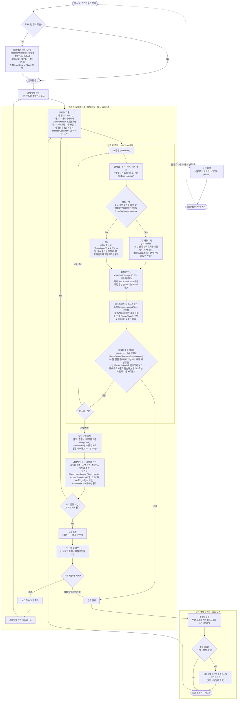

# 전투 플로우 설계 — 하이브리드 모델 (실시간 틱 + 오프라인 수식)

## 1. 배경 및 목적

사용자가 "몬스터 조우 → 전투 → 전리품 획득 → 몬스터 조우"를 큰 흐름으로 하는 mermaid `flowchart`를
제시했다. 다이어그램 자체는 웨이브/보스/실패 분기를 갖춘 실시간 전투 루프를 담고 있었으나,
`IDLE_RPG`가 **방치형(Idle) 서버 게임**이라는 전제와 대조하면 다음이 비어 있었다:

- 오프라인/자동 진행 경로 부재 (방치형의 핵심)
- 전투 연산 모델(실시간 틱 vs 수식) 미정의
- 전투 밖 성장 루프 부재 → 실패 시 무한 루프
- 실패 처리 규칙(강등 vs 부활) 모호, 스킬 자원 게이팅 미정, 다중 대상 미고려

기존 코드(`GameServer/`)에는 이미 `OfflineProgressionManager.ProcessOfflineTime`,
`RewardComponent.GenerateLoot(int killCount)` 같은 **킬수/시간 기반 수식 스텁**과,
`BattleManager.CalcFinalDamage`(구현 완료), `BuffManager.Update(deltaTime)`,
`Entity.Update(deltaTime)` 같은 **실시간 틱 스텁**이 공존한다. 즉 설계 의도 자체가
"온라인=실시간 틱, 오프라인=수식"의 하이브리드였다는 것이 코드에서 드러난다.

이번 사이클의 목적은 사용자 제시 플로우차트를 이 하이브리드 모델에 맞춰 **완성형 다이어그램으로
보강**하고, 구현 전 반드시 확정해야 할 설계 결정(실패 처리, 스킬 자원, 자동전투 여부)을 고정하는
것이다. 실제 Stage/Wave/Boss/Spawner 클래스 구현은 다음 사이클로 미룬다.

## 2. 설계 결정

| 항목 | 채택안 | 대안 | 사유 |
|------|--------|------|------|
| 연산 모델 | **하이브리드**(온라인 실시간 틱 / 오프라인 수식, 동일 파라미터로 정합성 유지) | 완전 실시간 틱만 / 완전 수식만 | 기존 코드가 이미 두 경로(`BattleManager`+`Entity.Update` vs `OfflineProgressionManager`)를 스텁으로 갖고 있어, 한쪽만 채택하면 다른 절반이 죽은 코드가 됨. 온라인 정밀도와 오프라인 서버 부하 절감을 동시에 취함 |
| 실패 처리 | **제자리 부활(코스트 지불)**, 강등 없음 | 이전 스테이지 강등 / 조건별 분기(일반=부활, 보스=재시작) | 방치형에서 강등은 스트레스 요인이 큼. 부활 코스트(골드/쿨다운)로 실패에 비용을 부여하되 진행도는 보존해 재도전 유도 |
| 스킬 자원 | **쿨타임 + 마나** | 쿨타임만 | 자원 게이팅이 있어야 스킬 사용 판단(`t2` 분기)에 의미가 생김. 단, 현재 `StatType` enum에 마나가 없어 후속 스탯 확장 필요(§7) |
| 자동 전투 | **완전 자동**, 유저 개입 없음 | 자동+수동 스킬 발동 옵션 | 온라인/오프라인 결과 정합성을 지키려면 유저 개입 변수를 배제하는 편이 수식과의 대응이 단순함. 액티브 플레이 보상은 후속 사이클 검토 |

## 3. 완성형 다이어그램



### 원본 대비 보강 요약

| # | 원본의 부족한 점 | 완성형에서 보강 |
|---|------------------|-----------------|
| 1 | 오프라인/방치 경로 없음 | 세션 계층 추가: `오프라인 정산(수식)` ↔ `이탈→저장→타이머` |
| 2 | `s2` 행동 주체 불명 | **완전 자동** — `t2` 행동 선택(스킬 vs 평타)을 서버 AI가 결정 |
| 3 | 실패 후 무한 루프(성장 없음) | `GROW` 서브그래프: 부활 코스트 → 성장(강화/투자/업글) → 재도전 |
| 4 | 실시간/수식 모델 미정의 | 하이브리드 명시 + 정합성 원칙(§4) |
| 5 | 시간(Δt) 진행 지점 없음 | `t0 Δt 진행`을 루프 헤드에 고정, 보스전 제한시간 감소 |
| 6 | 단일 대상 가정 | `웨이브 N마리` + 생존 판정을 **전멸 판정**(`c1`/`c2`)으로 |
| 7 | 버프/디버프 관리 없음 | `t5 BuffManager.Update` — 지속시간·DoT 갱신 |
| 8 | 스킬 자원 없음 | **마나** 회복(`t1`)·게이팅(`t2`)·소모(`t3s`) |
| 9 | 보상=골드/경험치만 | 아이템 드롭(`DropTable`) 추가 |
| 10 | 레벨업 vs 등반 혼재 | `r2 레벨업`(캐릭터)과 `b4 등반`(스테이지) 분리 |
| 11 | `s_fail` 강등/부활 OR 애매 | **제자리 부활**로 단일화, 강등 제거 |
| 12 | `\n` 렌더 불가(mermaid는 `<br/>` 필요) | 전부 `<br/>`로 교체 |

**구현 완료 갱신(2026-07-05 TDD 사이클):** 위 표의 `t1`(마나 회복)·`t2`(마나 게이팅)·`t4`(피해량)·
`t5`(버프 갱신, DoT 제외)·`r1`(경험치/골드/아이템 드롭)·오프라인 정산 경로는 실제 코드로 구현되어
`GameServer.Tests`(41개 테스트)로 검증됨. `t3s`의 스킬 발동 루프 자체, `s1/b1/w1/b4`(웨이브·보스·스폰·등반),
DoT는 여전히 다음 사이클 대상.

**구현 완료 갱신(2026-07-05 BattleLoop 사이클):** `t0`~`c2`의 라운드제 골격(`GameServer/Systems/BattleLoop.cs`)이
구현되어 `Main.cs`가 실제로 무한히 반복 실행된다. 단, 스코프를 의도적으로 좁혔다 —
단일 플레이어 vs 단일 몬스터(웨이브·다중 몬스터 없음), 공속 쿨타임 없이 매 틱 1회 라운드제 교환
(`t3s` 스킬 분기 없이 항상 `t3a` 평타만), 몬스터 처치 시 같은 인스턴스가 `RestoreResources()`로
즉시 재등장(`MonsterSpawner` 없음), 플레이어 사망 시 `FAIL`/`GROW` 서브그래프 대신 즉시 무료
부활로 단순화(부활 코스트는 여전히 미구현). `s1/b1/w1/b4`(웨이브·보스·스폰·등반)와 `t3s`(스킬)는
여전히 다음 사이클 대상.

## 4. 컴포넌트 구조

다이어그램의 각 노드가 요구하는 컴포넌트. **2026-07-05 TDD 사이클에서 스텁 구현이 완료**된 항목은
"구현됨"으로 표시. `BattleLoop`은 2026-07-05 후속 사이클에서 스코프를 좁혀 구현 완료(아래 참고).
`Stage`/`Wave`/`MonsterSpawner`/`ReviveCostCalculator`는 여전히 **다음 구현 사이클의 청사진**
(실제 파일 아님).

```
GameServer/
├─ Stats/
│  ├─ StatType.cs        — 구현됨. Mana/ManaRegen 추가
│  ├─ BaseStats.cs       — 구현됨. Mana/ManaRegen 필드 추가. ※ operator+는 여전히 미구현
│  │                        스텁(NotImplementedException) — 파이프라인이 필드를 직접 읽어 호출되지
│  │                        않으므로 런타임 영향은 없음(코드리뷰 F9)
│  ├─ FinalStats.cs      — 구현됨. MaxMana/CurrentMana/ManaRegen + AttackScaling 필드 추가
│  │                         (AttackScaling은 코드리뷰 F1 수정으로 추가: 무기 배율을 온라인·오프라인이
│  │                         동일하게 읽도록 함)
│  └─ IMasterDataTable.cs — 신규(코드리뷰 H1, 2026-07-06). Monster/Equipment/LevelTable이 공통
│                            구현하는 조회 인터페이스(GetById/All). Stats에 둔 이유: Items/Systems
│                            양쪽이 순환 의존 없이 구현할 수 있는 "기반, 무의존" 계층이기 때문
├─ Items/
│  ├─ EquipmentTemplate.cs — 구현됨(2026-07-06). 장비 1종의 순수 데이터 정의(JSON 이관 대비,
│  │                          MonsterTemplate과 동일 패턴)
│  ├─ EquipmentTable.cs   — 구현됨(2026-07-06), 코드리뷰 H1(2026-07-06)로 static class →
│  │                          IMasterDataTable<int,EquipmentTemplate> 구현 인스턴스로 전환.
│  │                          무기·방어구·장신구 각 5종(총 15종) 하드코딩
│  │                          마스터 데이터 + GetById 조회
│  └─ EquipmentFactory.cs — 구현됨(2026-07-06). EquipmentTemplate → Weapon/Armor/Accessory
│                             구체 타입 생성(Slot으로 분기)
├─ Combat/
│  ├─ BuffManager.cs      — 구현됨. ApplyEffect/RemoveEffect/Update/GetAllActiveModifiers
│  └─ StatusEffect.cs     — 구현됨. Tick/IsExpired/GetModifiers + Modifiers 필드 추가
├─ Entities/
│  ├─ Entity.cs           — 구현됨. TakeDamage/Update/TryConsumeMana/RestoreResources +
│  │                        통합 스탯 집계 파이프라인(UpdateFinalStats, Flat→PercentAdd→PercentMult) +
│  │                        GetAttackScaling 훅(코드리뷰 F1). TakeDamage/TryConsumeMana 음수 값
│  │                        가드 추가(코드리뷰 F5).
│  │                        BaseStats/BaseTraits를 public으로 변경(외부에서 설정할 경로가 없던 gap 해소).
│  │                        ※ Traits.operator+(`Stats/Traits.cs`)도 BaseStats와 동일하게 미구현
│  │                        스텁이나 호출되지 않아 런타임 영향 없음(코드리뷰 F9)
│  ├─ Player.cs           — 구현됨. AddExp/AddGold, GetExtraModifiers(장비 위임),
│  │                        GetAttackScaling(장착 무기 위임, 코드리뷰 F1).
│  │                        기존 UpdateFinalStats 오버라이드(ModType 무시·버프 미반영 버그) 제거
│  └─ Monster.cs          — 구현됨. GetExtraModifiers, MonsterAffixes를 public init으로 변경
├─ Systems/
│  ├─ BattleManager.cs    — 구현 완료(이전 사이클) — 틱 루프에서 t4 호출.
│  │                        코드리뷰 F1로 CalcFinalDamage가 FinalStats.AttackScaling을 자동으로
│  │                        곱하도록 수정, attackScaling 파라미터는 "추가 배율"로 의미 축소
│  ├─ OfflineProgressionManager.cs — 구현됨(기대 DPS 공식 기반 killCount 환산, 코드리뷰
│  │                        F1(AttackScaling 누락)·F2(음수 offlineSeconds 클램프) 수정)이나
│  │                        **2026-07-06 임시 주석 처리됨**(Main.cs가 온라인 BattleLoop에만 집중;
│  │                        재활성화 방법은 §6 참고)
│  ├─ RewardComponent.cs  — 구현됨. GenerateLoot(킬수·드롭테이블 확률 롤), 결정적 RNG 주입 생성자 추가.
│  │                        코드리뷰 F3(음수 killCount 클램프)·F4(MinQty>MaxQty 방어) 수정
│  ├─ LootItem.cs         — 신규(Item 구체 타입 부재로 추가, DropPool과 동일한 보완 패턴)
│  ├─ BattleLoop.cs       — 구현됨(스코프 축소판). 단일 Player vs 단일 Monster 라운드제 무한 루프.
│  │                        Tick(내부, 단위 테스트 대상)/RunAsync(공개, CancellationToken 없으면 진짜 무한)로 분리.
│  │                        웨이브·스킬·부활 코스트는 미구현 — 아래 Stage 이하와 동일하게 다음 사이클 대상.
│  │                        2026-07-06: 몬스터 처치로 경험치 획득 직후 PlayerLevelSystem.CheckLevelUp
│  │                        호출 추가(레벨업 배선). 코드리뷰 H2(2026-07-06): Run(Thread.Sleep)을
│  │                        RunAsync(await Task.Delay)로 전환해 대기 중 스레드 미점유. 코드리뷰 H1:
│  │                        PlayerLevelSystem을 생성자 주입받도록 변경(전역 static 결합 제거)
│  ├─ MonsterTemplate.cs  — 구현됨(2026-07-06). 몬스터 1종의 순수 데이터 정의(JSON 이관 대비)
│  ├─ MonsterTable.cs     — 구현됨(2026-07-06), 코드리뷰 H1(2026-07-06)로 static class →
│  │                        IMasterDataTable<int,MonsterTemplate> 구현 인스턴스로 전환.
│  │                        CreateDefault()로 기본 10종 생성, 생성자로 커스텀 목록 주입 가능
│  ├─ MonsterFactory.cs   — 구현됨(2026-07-06). MonsterTemplate → 즉시 투입 가능한 Monster 생성
│  ├─ LevelTemplate.cs    — 구현됨(2026-07-06). 레벨 1개의 순수 데이터 정의(JSON 이관 대비)
│  ├─ LevelTable.cs       — 구현됨(2026-07-06), 코드리뷰 H1(2026-07-06)로 MonsterTable과 동일하게
│  │                        인스턴스 전환(GetByLevel→GetById로 명칭 통일). MaxLevel도 All.Count 대신
│  │                        All.Max(t=>t.Level)로 수정(레벨 갭에도 정확)
│  ├─ PlayerLevelSystem.cs — 구현됨(2026-07-06). ApplyLevel(스탯 적용)/CheckLevelUp(임계치 판정,
│  │                        한 번에 여러 레벨 점프도 처리, MaxLevel에서 정지). 코드리뷰 H1(2026-07-06)로
│  │                        인스턴스 전환, IMasterDataTable<int,LevelTemplate> 생성자 주입
│  ├─ Stage.cs            (신규 예정) — 스테이지 번호, 웨이브 목록, 보스 조건(N/N), 제한시간
│  ├─ Wave.cs              (신규 예정) — 웨이브당 몬스터 스폰 목록
│  ├─ MonsterSpawner.cs   (신규 예정) — 웨이브/보스 스폰 팩토리(MonsterTable에서 여러 종을 로테이션)
│  └─ ReviveCostCalculator.cs (신규 예정) — 부활 코스트 공식 (§8 미결)
tests/
└─ GameServer.Tests/      — 신규. xUnit, GameServer ProjectReference, InternalsVisibleTo 부여받음
```

**의존 관계:** `BattleLoop`(다음 사이클)가 `BattleManager`(피해량)·`BuffManager`(상태이상)·`Entity`(생사 판정)를
구동하고, 결과를 `RewardComponent`에 위임할 예정. `OfflineProgressionManager`는 `BattleManager`와
동일한 `DefenseConstant`·기대 DPS 파라미터를 공유해 오프라인 수식 결과가 온라인 시뮬레이션과 어긋나지 않도록 한다(구현됨).

## 5. 핵심 API

**`BattleLoop`(2026-07-05 구현 완료 — `GameServer/Systems/BattleLoop.cs`, 스코프 축소판):**

```csharp
namespace GameServer.Systems;

public enum BattleTickEvent { None, MonsterDefeated, PlayerDefeated }

public sealed class BattleLoop
{
    // 1회 교환(순수 로직, sleep/취소 없음) — 단위 테스트 대상이라 internal로 노출
    internal BattleTickEvent Tick(Player player, Monster monster, float deltaTime)
    {
        player.Update(deltaTime);
        monster.Update(deltaTime);

        monster.TakeDamage(BattleManager.Instance.CalcFinalDamage(player, monster));
        if (!monster.IsAlive)
        {
            var loot = monster.Rewards.GenerateLoot(1);
            player.AddExp(loot.TotalExp);
            player.AddGold(loot.TotalGold);
            monster.RestoreResources(); // 같은 인스턴스로 즉시 재등장 — MonsterSpawner 없음
            return BattleTickEvent.MonsterDefeated;
        }

        player.TakeDamage(BattleManager.Instance.CalcFinalDamage(monster, player));
        if (!player.IsAlive)
        {
            player.RestoreResources(); // 즉시 무료 부활 — ReviveCostCalculator는 다음 사이클
            return BattleTickEvent.PlayerDefeated;
        }

        return BattleTickEvent.None;
    }

    // cancellationToken 미전달(기본값) 시 취소 불가 → 진짜 무한 루프. Main.cs는 토큰 없이 호출한다.
    public void Run(Player player, Monster monster, TimeSpan? tickInterval = null,
        CancellationToken cancellationToken = default) { /* Tick 반복 + Thread.Sleep */ }
}
```

`t3s`(스킬 자동 시전)는 정의된 스킬 체계 자체가 없어 여전히 미구현이라, `Tick`은 항상 평타(`t3a`)만
수행한다. 공속(`AtkSpeed`) 기반 쿨타임도 아직 없어 매 틱 1회 라운드제 교환으로 단순화했다.

**`OfflineProgressionManager`(이번 사이클 구현 완료 — `GameServer/Systems/OfflineProgressionManager.cs`):**

```csharp
public LootData ProcessOfflineTime(Player player, Monster stageMonster, int offlineSeconds)
{
    var attacker = player.FinalStats;
    var target = stageMonster.FinalStats;

    var defMult = DefenseConstant / (Math.Max(0, target.Def - attacker.CombatTraits.ArmorPen) + DefenseConstant);
    double effectiveDps = attacker.Atk
        * attacker.CombatTraits.AtkSpeed
        * (1 + attacker.CombatTraits.CritProb * attacker.CombatTraits.CritDmg)
        * defMult;

    int killCount = target.MaxHp > 0 && effectiveDps > 0
        ? (int)Math.Floor(offlineSeconds * effectiveDps / target.MaxHp)
        : 0;

    return stageMonster.Rewards.GenerateLoot(killCount);
}
```

`DefenseConstant`(=100)는 `BattleManager.CalcFinalDamage`와 동일한 값을 사용해 온라인/오프라인 뎀감 공식을
일치시킨다. 치명타는 매 타격 RNG 대신 `1 + CritProb×CritDmg` 기대값으로 치환해 결정적으로 계산한다.

## 6. 변경 파일 목록

**이번 사이클 (설계만):**
- 신규: `plan/battle_system_0705.md` (본 문서)

**2026-07-05 TDD 사이클 완료 (신규):**
- `tests/GameServer.Tests/`(GameServer.Tests.csproj, SmokeTests.cs + Combat/Entities/Systems 하위 테스트, 41개)
- `GameServer/Systems/LootItem.cs`(Item 구체 타입 부재 보완, DropPool과 동일 패턴)

**2026-07-05 TDD 사이클 완료 (수정 — 스텁 실구현):**
- `Combat/StatusEffect.cs`(Tick/IsExpired/GetModifiers + Modifiers 필드), `Combat/BuffManager.cs`(ApplyEffect/RemoveEffect/Update/GetAllActiveModifiers)
- `Entities/Entity.cs`(TakeDamage/Update/TryConsumeMana/RestoreResources + 통합 UpdateFinalStats 파이프라인, BaseStats/BaseTraits public화)
- `Entities/Player.cs`(AddExp/AddGold/GetExtraModifiers, 버그 있던 UpdateFinalStats 오버라이드 제거), `Entities/Monster.cs`(GetExtraModifiers, MonsterAffixes public화)
- `Systems/RewardComponent.cs`(GenerateLoot + 결정적 RNG 주입 생성자), `Systems/OfflineProgressionManager.cs`(ProcessOfflineTime)
- `Stats/StatType.cs`/`BaseStats.cs`/`FinalStats.cs`(Mana/ManaRegen 추가), `GameServer/GameServer.csproj`(InternalsVisibleTo), `IDLE_RPG.sln`(GameServer.Tests 등록)

**2026-07-05 코드리뷰 수정 사이클 완료 (동일 날짜, TDD 사이클 직후 진행):**
다이어그램 대비 실제 구현을 검토한 결과 발견된 F1(온라인/오프라인 정합성 버그)과 F2~F5(값 검증
누락)를 TDD로 수정. F9~F10(문서 라벨 정확도)도 함께 정리.
- `Stats/FinalStats.cs`(AttackScaling 필드 추가), `Entities/Entity.cs`(GetAttackScaling 훅 +
  TakeDamage/TryConsumeMana 음수값 가드), `Entities/Player.cs`(GetAttackScaling 오버라이드)
- `Systems/BattleManager.cs`(CalcFinalDamage가 FinalStats.AttackScaling 자동 반영),
  `Systems/OfflineProgressionManager.cs`(attackScaling 반영 + offlineSeconds 클램프),
  `Systems/RewardComponent.cs`(killCount 클램프 + MinQty>=MaxQty 방어)
- `GameServer/Main.cs`(CalcFinalDamage 호출부 단순화, 헤더 주석 갱신)
- 신규 `tests/GameServer.Tests/Systems/BattleManagerTests.cs` + 기존 테스트 파일에 F1~F5 회귀
  테스트 9건 추가(총 50개 통과)

**2026-07-05 코드리뷰 F6/F8/F11 후속 정리 완료 (상세: `plan/battle_review_followup_0705.md`):**
- `Entities/Entity.cs`: 사망(`CurrentHp<=0`) 시 `Update()` 전체 조기 리턴 + `IsAlive` 프로퍼티 추가(F6)
- `Items/EquipmentInventory.cs`: `GetAllModifiers()`의 `GroupBy+Sum` 병합 제거, 이어붙이기+캐싱만 유지(F8) —
  장비 내부 PercentMult가 서로 다른 소스와 동일하게 독립 곱연산되도록 통일
- `Systems/RewardComponent.cs`: `GenerateLoot`을 `ItemMetaId`별 수량 집계로 변경, 할당량이
  `killCount`가 아닌 `DropTable` 크기에 비례하도록 개선(F11)
- 신규 `tests/GameServer.Tests/Items/EquipmentInventoryTests.cs` + 기존 테스트 파일에 회귀
  테스트 8건 추가/수정(총 58개 통과)

**2026-07-05 BattleLoop 사이클 완료 (신규/수정):**
- 신규 `GameServer/Systems/BattleLoop.cs`: 단일 Player vs 단일 Monster 라운드제 무한 루프
  (`Tick`은 internal 순수 로직, `Run`은 `CancellationToken` 미전달 시 진짜 무한 루프)
- 신규 `tests/GameServer.Tests/Systems/BattleLoopTests.cs`(4개 — 처치/생존/사망부활/취소 케이스)
- `GameServer/Main.cs`: 예제에 `BaseStats.Hp`(플레이어 100·몬스터 30) + `Def`(몬스터 5) 부여,
  `RestoreResources()` 호출 추가, 1회성 `CalcFinalDamage` 호출을 `new BattleLoop().Run(player, monster)`로 교체

**2026-07-06 OfflineProgressionManager 임시 주석 처리:**
현재 사이클은 `Main.cs`의 온라인 `BattleLoop`에만 집중하기로 해, 사용하지 않는
`OfflineProgressionManager`를 삭제 대신 블록 주석(`/* */`)으로 컴파일 대상에서 제외했다.
- `GameServer/Systems/OfflineProgressionManager.cs`: 클래스 전체를 `/* */`로 감싸고 재활성화
  방법을 파일 상단에 명시
- `tests/GameServer.Tests/Systems/OfflineProgressionManagerTests.cs`: 동일하게 전체 주석 처리
  (`GameServer.Tests` 63개 → 57개로 일시 감소, 삭제 아님)
- `GameServer/Entities/Entity.cs`·`GameServer/Systems/BattleManager.cs`: 댕글링 `cref` 경고(CS1574)
  방지를 위해 `<see cref="OfflineProgressionManager"/>` 링크를 평문 텍스트로 임시 변경
- **재활성화 방법:** 위 두 `.cs` 파일의 `/* */` 블록을 해제하고, 두 `cref` 텍스트를 다시
  `<see cref="...OfflineProgressionManager"/>` 형태로 되돌리면 된다.

**2026-07-06 몬스터 마스터 데이터 테이블(10종) 완료:**
- 신규 `GameServer/Systems/MonsterTemplate.cs`: 몬스터 1종의 순수 데이터 정의(전부 기본
  타입·단순 리스트라 `System.Text.Json`으로 그대로 (역)직렬화 가능 — JSON 이관 대비)
- 신규 `GameServer/Systems/MonsterTable.cs`: 슬라임~리치 10종을 난이도 순으로 하드코딩,
  `GetById`는 미존재 ID에 `KeyNotFoundException`. 나중에 JSON 이관 시 `All`의 초기화식만
  교체하면 되도록 하드코딩을 이 파일 하나로 격리
- 신규 `GameServer/Systems/MonsterFactory.cs`: `MonsterTemplate` → `UpdateFinalStats`/
  `RestoreResources`까지 끝낸 즉시 투입 가능한 `Monster` 인스턴스 생성
- `GameServer/Main.cs`: 하드코딩 몬스터 생성부를 `MonsterFactory.CreateMonster(MonsterTable.GetById(2003))`
  (고블린)로 교체
- 신규 `tests/GameServer.Tests/Systems/MonsterTableTests.cs`(4개)·`MonsterFactoryTests.cs`(5개)

**2026-07-06 장비 마스터 데이터 테이블(무기·방어구·장신구 각 5종, 총 15종) 완료:**
- 신규 `GameServer/Items/EquipmentTemplate.cs`: 장비 1종의 순수 데이터 정의(`MonsterTemplate`과
  동일 패턴, JSON 이관 대비). `AttackScaling`은 `Slot`이 `Weapon`일 때만 의미 있음
- 신규 `GameServer/Items/EquipmentTable.cs`: 15종 하드코딩, `GetById`는 미존재 ID에
  `KeyNotFoundException`(`MonsterTable`과 동일 계약)
- 신규 `GameServer/Items/EquipmentFactory.cs`: `EquipmentTemplate.Slot`에 따라 `Weapon`/`Armor`/
  `Accessory` 중 알맞은 구체 타입을 생성, `BaseModifiers`는 복사해 전달(인스턴스 간 리스트 공유 방지)
- `GameServer/Main.cs`: 하드코딩 무기/방어구 생성부를 테이블 기반으로 교체하고 장신구도 신규 장착
  (기존 방어구가 비정상적으로 Atk+65를 주던 데모용 값이 사라져, 이제 몬스터와 실제로 데미지를
  주고받는 자연스러운 전투 페이스로 바뀜 — 밸런스 조정은 후속 대상)
- 신규 `tests/GameServer.Tests/Items/EquipmentTableTests.cs`(5개)·`EquipmentFactoryTests.cs`(5개)

**2026-07-06 플레이어 레벨 테이블(10레벨) + 레벨업 배선 완료:**
- 신규 `GameServer/Systems/LevelTemplate.cs`: 레벨 1개의 순수 데이터 정의(`MonsterTemplate`과
  동일 패턴, JSON 이관 대비)
- 신규 `GameServer/Systems/LevelTable.cs`: 1~10레벨 하드코딩(누적 필요 경험치 + Hp/Atk/Def),
  `GetByLevel`은 미존재 레벨에 `KeyNotFoundException`
- 신규 `GameServer/Systems/PlayerLevelSystem.cs`: `ApplyLevel`(레벨 스탯을 `BaseStats`에 반영 +
  `UpdateFinalStats` 호출)·`CheckLevelUp`(임계치 판정, 한 번에 여러 레벨 점프도 정확히 처리,
  `MaxLevel`에서 정지)
- `GameServer/Systems/BattleLoop.cs`: `Tick`이 몬스터 처치로 경험치를 얻은 직후
  `PlayerLevelSystem.CheckLevelUp` 호출(레벨업 실제 배선), `LogTick`에 `player.Level` 표시 추가
- `GameServer/Main.cs`: 플레이어 초기 스탯 세팅(`BaseStats.Hp = 100` 하드코딩)을
  `PlayerLevelSystem.ApplyLevel(player, 1)`로 교체
- 신규 `tests/GameServer.Tests/Systems/LevelTableTests.cs`(6개)·`PlayerLevelSystemTests.cs`(5개),
  기존 `BattleLoopTests.cs`에 레벨업 배선 검증 테스트 1건 추가

**2026-07-06 코드리뷰 H1/H2 수정 완료 (`code-review-orchestrator`, 종합 82/100 → REQUEST CHANGES):**
테이블/팩토리 패턴 코드에 대한 아키텍처·보안·성능·스타일 4개 병렬 리뷰에서 나온 High 2건을
리뷰어 제안대로(인터페이스+DI) 전체 수정. 상세: `_workspace/03_consolidated_report.md`.
- 신규 `GameServer/Stats/IMasterDataTable.cs`: `IReadOnlyList<T> All`/`T GetById(TKey)` 계약.
  Items/Systems 양쪽이 순환 의존 없이 구현하도록 "기반" 계층인 Stats에 배치
- `Systems/MonsterTable.cs`·`Items/EquipmentTable.cs`·`Systems/LevelTable.cs`: static class →
  위 인터페이스를 구현하는 인스턴스 클래스로 전환. 하드코딩 데이터는 `CreateDefault()` 정적
  팩토리(정적 생성자 아님)에서만 생성 — 나중에 JSON 로딩으로 바꿔도 예외가
  `TypeInitializationException`으로 래핑되지 않고, 생성자로 커스텀 데이터셋 주입도 가능(H1)
- `LevelTable.GetByLevel`→`GetById`로 이름 통일, `MaxLevel`을 `All.Count` 대신
  `All.Max(t=>t.Level)`로 수정(레벨 데이터에 갭이 있어도 정확)
- `Systems/PlayerLevelSystem.cs`: static class → `IMasterDataTable<int,LevelTemplate>`를
  생성자로 받는 인스턴스로 전환
- `Systems/BattleLoop.cs`: `PlayerLevelSystem`을 생성자로 주입받도록 변경(기본 생성자는
  `CreateDefault()`로 위임해 `new BattleLoop()` 호출부 하위 호환). `Run(Thread.Sleep)` →
  `RunAsync(await Task.Delay)`로 전환해 대기 중 스레드를 점유하지 않도록 함(H2 — 다중 전투
  동시 실행 시 스레드 기아 방지)
- `GameServer/Main.cs`: 테이블/레벨시스템을 `CreateDefault()`로 명시적으로 생성해 사용,
  `BattleLoop.Run` 호출을 `await new BattleLoop(levelSystem).RunAsync(...)`로 교체
- 기존 6개 테스트 파일을 인스턴스 기반 호출로 갱신 + 인스턴스 독립성·`MaxLevel` 갭 처리·
  커스텀 레벨 테이블 주입을 검증하는 신규 테스트 4건 추가(총 92개 통과)
- Medium/Low 항목(조회 로직 3벌 중복, `CheckLevelUp` 중복 조회, 문서 주석 누락, JSON 이관 시
  값 검증 등)은 의도적으로 이번 사이클 범위 밖으로 남김(§8 참고)

**2026-07-06 코드리뷰 Medium/Low 수정 완료 (advisor 자문으로 스코프 정제):**
JSON 로더가 아직 없는 상태에서의 값 검증·경로 보호·enum 검증, 그리고 다중 전투 동시 실행을
전제로 한 `LogTick`/`InstanceId` 최적화처럼 "존재하지 않는 미래를 위한" 항목은 의도적으로
제외하고, 지금 바로 실체가 있는 항목만 수정했다.
- 신규 `GameServer/Stats/MasterDataTable.cs`: `IMasterDataTable<TKey,T>` 공통 기반 추상 클래스.
  생성자에서 `Dictionary<TKey,T>` 인덱스를 1회 구축해 `GetById`를 O(1)로 만들고(코드리뷰 Medium —
  세 테이블에 중복돼 있던 foreach 선형 탐색 제거), 부수 효과로 `ToDictionary`가 중복 키를 생성
  시점에 즉시 `ArgumentException`으로 걸러낸다(코드리뷰 Low 보안 항목 중 "중복 ID" 부분을
  JSON 로더 없이도 지금 해소 — "갭이 있는 레벨"에 대한 `CheckLevelUp` 내성은 여전히 미해결이라
  §8에 유지)
- `Systems/MonsterTable.cs`·`Items/EquipmentTable.cs`·`Systems/LevelTable.cs`: 위 기반 클래스를
  상속하도록 전환(`GetById`/`All` 중복 구현 제거), ID 대역 규약(2000/3000/4000/5000/6000번대)을
  클래스 `<remarks>`에 명문화(코드리뷰 스타일 Low)
- 신규 `GameServer/Systems/PlayerFactory.cs`: `new Player{}` → `ApplyLevel` → `RestoreResources`
  3단계 수동 호출 시 마지막 호출을 빠뜨리면 `CurrentHp=0`으로 즉사 상태가 되는 함정을 제거
  (`MonsterFactory`/`EquipmentFactory`와 대칭, 코드리뷰 아키텍처 Medium). `ApplyLevel` 자체는
  전투 중 레벨업에도 재사용되므로 건드리지 않음(자동 회복 부작용 방지)
- `Systems/MonsterFactory.cs`: `CreateMonster`→`Create`로 이름 통일(`EquipmentFactory.Create`와
  네이밍 관례 일치, 코드리뷰 스타일 Low)
- `Systems/MonsterTable.cs`·`Items/EquipmentTable.cs`·`Systems/MonsterFactory.cs`·
  `Items/EquipmentFactory.cs`·`Systems/PlayerLevelSystem.cs`: CLAUDE.md 필수 Thread Safety/
  Memory Allocation/Blocking `<remarks>` 보강(코드리뷰 스타일 Medium)
- `GameServer/Main.cs`: `PlayerFactory.Create`/`MonsterFactory.Create` 사용으로 교체,
  `AccountId = 000`(8진 리터럴처럼 보이는 모호한 표기)→`0`, `BigNumber` TODO 주석을 트리거
  조건 명시형으로 보강(코드리뷰 스타일 Low), 장비 장착 후 `UpdateFinalStats`/`RestoreResources`
  재호출 추가(팩토리 도입으로 레벨 적용 시점이 장비 장착보다 앞으로 당겨지며 생긴 간극 보정)
- 기존 5개 테스트 파일에 중복 키 fail-fast 검증 3건 + 팩토리 리네이밍 반영, 신규
  `tests/GameServer.Tests/Systems/PlayerFactoryTests.cs`(4개) 추가(총 99개 통과)
- 의도적으로 남긴 항목(모두 §8로 이동): JSON 값 검증/경로 보호/enum 검증(로더 자체가 없음),
  `LogTick`의 매 틱 `Console.WriteLine`(다중 전투 동시 실행 전제, 현재는 단일 데모 루프뿐이라
  변경 시 관측 가능한 데모 출력만 바뀌고 실익이 없음), `CheckLevelUp`의 이중 조회(Dictionary
  인덱스 도입으로 양쪽 다 O(1)이 되어 실질적 이득 없음), `LevelTable` 갭 데이터에 대한
  `CheckLevelUp` 내성(설계 결정이 필요한 사안), `EquipmentTemplate.AttackScaling` god-data 소지 +
  `EquipmentFactory`의 `SlotType` switch 확장점(현재 규모에서 리뷰어가 직접 "당장 불필요"라고
  명시), `MonsterFactory`/`EquipmentFactory`의 `Guid.NewGuid()` 할당(미래 스포너 최적화 대상)

**다음 구현 사이클 예정 (신규, 미착수):**
- `Systems/Stage.cs`, `Systems/Wave.cs`, `Systems/MonsterSpawner.cs`, `Systems/ReviveCostCalculator.cs`
- 스킬 정의 체계 + `BattleLoop.Tick`의 `t3s`(스킬 자동 시전) 분기, `AtkSpeed` 기반 실시간 쿨타임

## 7. 빌드 검증

```powershell
dotnet build IDLE_RPG.sln
dotnet test tests/GameServer.Tests/GameServer.Tests.csproj
dotnet run --project GameServer/GameServer.csproj
```

**실행 결과(2026-07-05, F6/F8/F11 후속 정리 반영):** 솔루션 전체 0 warning / 0 error. `GameServer.Tests`
58/58 통과. 기존 `IdleRpg.HarnessTests` 98/98 영향 없음. `GameServer/Main.cs` 예제 회귀 없음 확인
(`total damage = 99` 유지 — 무기 배율 적용 메커니즘은 수동 파라미터 전달에서
`FinalStats.AttackScaling` 자동 반영으로 바뀌었으나 결과값은 동일).

**실행 결과(2026-07-05, BattleLoop 사이클):** 솔루션 전체 0 warning / 0 error. `GameServer.Tests`
63/63 통과(F6/F8/F11까지의 58개 + `BattleLoopTests` 4개 + 기존 테스트 조정 반영). 기존
`IdleRpg.HarnessTests` 98/98 영향 없음. `Main.cs`는 더 이상 1회성 `total damage` 출력이 아니라
`BattleLoop.Run`으로 무한 반복되며, 실제로 몇 초간 실행해 몬스터 처치·재등장·경험치/골드 누적
로그가 계속 출력되는 것을 육안으로 확인함(Ctrl+C로 종료).

**실행 결과(2026-07-06, 오프라인 주석 처리 + 몬스터 테이블 10종):** 솔루션 전체 0 warning / 0 error.
`GameServer.Tests` **66/66** 통과(63개에서 `OfflineProgressionManagerTests` 6개 제외한 57개 +
`MonsterTableTests` 4개 + `MonsterFactoryTests` 5개). 기존 `IdleRpg.HarnessTests` 98/98 영향 없음.
`Main.cs`가 `MonsterTable.GetById(2003)`(고블린)로 몬스터를 생성하며, 실행 시 고블린의
`ExpDrop=6`/`GoldDrop=8`이 누적 로그에 정확히 반영되는 것을 육안으로 확인함.

**실행 결과(2026-07-06, 장비 테이블 15종):** 솔루션 전체 0 warning / 0 error. `GameServer.Tests`
**76/76** 통과(66개 + `EquipmentTableTests` 5개 + `EquipmentFactoryTests` 5개). 기존
`IdleRpg.HarnessTests` 98/98 영향 없음. `Main.cs`가 무기·방어구·장신구 전부 `EquipmentTable`에서
생성하며, 실행 시 플레이어와 고블린이 서로 데미지를 주고받는 전투가 정상 진행되는 것을 육안으로 확인함.

**실행 결과(2026-07-06, 플레이어 레벨 테이블 + 레벨업 배선):** 솔루션 전체 0 warning / 0 error.
`GameServer.Tests` **88/88** 통과(76개 + `LevelTableTests` 6개 + `PlayerLevelSystemTests` 5개 +
`BattleLoopTests` 신규 1개). 기존 `IdleRpg.HarnessTests` 98/98 영향 없음. 실행 시 누적 경험치가
20을 넘는 순간 `Lv.2`로 승급하고 `MaxHp`가 100→130으로 반영되는 것을 콘솔 로그로 직접 확인함
(레벨업이 자동 회복을 겸하지 않는다는 점도 함께 관찰됨 — 최대치만 늘고 현재 HP는 그대로라
직후 위험해질 수 있음, §8 참고).

**실행 결과(2026-07-06, 코드리뷰 H1/H2 수정):** 솔루션 전체 0 warning / 0 error. `GameServer.Tests`
**92/92** 통과(88개 + 인스턴스 독립성·`MaxLevel` 갭 처리·커스텀 테이블 주입 검증 신규 4건). 기존
`IdleRpg.HarnessTests` 98/98 영향 없음. `Main.cs`가 `RunAsync`(비동기)로 정상 실행되며 기존과
동일한 전투 페이스를 유지함을 육안으로 확인함.

**실행 결과(2026-07-06, 코드리뷰 Medium/Low 수정):** 솔루션 전체 0 warning / 0 error.
`GameServer.Tests` **99/99** 통과(92개 + 중복 키 fail-fast 검증 3건 + `PlayerFactoryTests` 4건).
기존 `IdleRpg.HarnessTests` 98/98 영향 없음. `Main.cs`를 몇 초간 직접 실행해 `PlayerFactory.Create`로
생성된 플레이어가 정상적으로 전투를 진행하고(HP 100에서 시작해 데미지 교환), 고블린을 처치해
로그가 정확히 출력되는 것을 육안으로 확인함.

## 8. 향후 확장 포인트 (미결 사항)

- 부활 코스트 공식 확정 (골드 지수 증가 vs 고정 쿨다운) — `ReviveCostCalculator`
- `Stage`/`Wave`/`MonsterSpawner`: 웨이브·보스 스폰(현재 `BattleLoop`은 단일 몬스터 재등장뿐,
  `MonsterTable`에서 여러 종을 로테이션하는 로직은 아직 없음), 스킬 자동 선택·발동(`t3s`),
  `AtkSpeed` 기반 실시간 쿨타임, DoT(지속 피해) 실행 루프
- `MonsterTable`/`EquipmentTable`/`LevelTable`의 `CreateDefault()` 하드코딩 데이터를 JSON 파일
  기반 로딩(`FromJson(path)` 등)으로 이관(코드리뷰 H1로 인터페이스+인스턴스 기반이 되어 로딩
  방식만 추가하면 됨). 이관 시 값 검증(DropChance 범위, 음수 스탯, enum 미정의 값 등, 경로 조작·
  파일 크기 제한, 코드리뷰 보안 도메인 Low 4건)과 `LevelTable`의 레벨 갭 데이터에 대한
  `CheckLevelUp` 내성(현재는 갭이 있으면 `player.Level+1`이 존재하지 않아 `KeyNotFoundException`
  으로 크래시 — 갭을 건너뛸지 막을지는 설계 결정 필요) 계층 도입 필요. 세 테이블의 조회 로직
  중복·`Dictionary` 인덱스화·문서 주석 누락은 2026-07-06 코드리뷰 Medium/Low 수정에서 이미 해소
  (`MasterDataTable<TKey,T>` 공통 기반 + 생성 시 중복 키 fail-fast)
- `BattleLoop.LogTick`의 매 틱 `Console.WriteLine`(다중 전투 동시 실행 시 콘솔 락 경합 우려로
  코드리뷰 Medium 지적) — 현재는 단일 데모 루프뿐이라 실익 없이 데모 출력만 바뀌므로 의도적으로
  보류. 실제로 여러 전투를 동시 실행하는 설계가 나오면 이벤트 전용 로깅/버퍼링으로 교체 검토
- `EquipmentTemplate.AttackScaling`이 `Weapon` 슬롯에서만 의미 있는 필드로 남아있는 god-data
  소지, `EquipmentFactory`의 `SlotType` switch가 슬롯 타입 추가 시 유일한 편집점인 점(코드리뷰
  아키텍처 Low) — 리뷰어도 "현재 규모에서 당장 리팩토링 필요 없음"이라 명시, 슬롯 종류가
  늘어날 때 재검토
- `MonsterFactory.Create`/`EquipmentFactory.Create`의 `Guid.NewGuid()` + 문자열 보간 `InstanceId`
  할당(코드리뷰 성능 Low) — 몬스터가 재사용(`RestoreResources`)되고 킬마다 재생성되지 않는 현재
  구조에선 GC 압력이 없음. `MonsterSpawner` 도입으로 킬마다 재스폰하는 구조가 되면 재검토
- 장비 밸런스 재조정(이번 사이클은 데모용 값) + 강화/제작 시 `Equipment.RandomModifiers`를
  실제로 채우는 로직(현재 `EquipmentFactory`는 항상 빈 채로 반환)
- 레벨업 시 자동 회복 여부 결정(현재는 `MaxHp`만 늘고 `CurrentHp`는 그대로라 레벨업 직후
  체력 비율이 급락할 수 있음) + 10레벨 초과 성장 곡선(현재 `LevelTable`은 10에서 정지)
- 루팅된 `AcquiredItems`를 저장할 플레이어 인벤토리(현재 `Player`는 `Equipment`만 있고 일반
  아이템 보관소가 없어, `BattleLoop`은 콘솔 로그만 출력하고 저장하지 않음)
- 웨이브당 몬스터 수·보스 조건(`N/N`)을 스테이지별로 가변화하는 데이터 스키마(JSON/ScriptableObject 등)
- `BigNumber` struct 활성화(현재 `double` 별칭) 시 `EquipmentInventory`/`Entity` 등 연쇄 영향 검토
- 아이템 마스터 데이터 조회 시스템(`LootItem`을 실제 `Weapon`/`Armor`/`Accessory`로 구체화)
- 멀티플레이 접점 (본 설계는 싱글 플레이 범위로 한정)
- 액티브 플레이 보상(수동 개입 시 추가 보상) 도입 여부 — 완전 자동 채택으로 이번 사이클엔 배제
