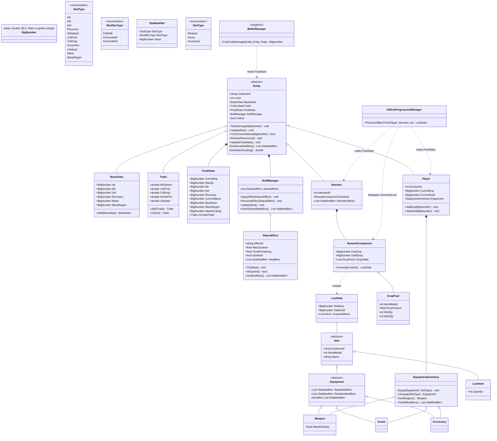

# GameServer 도메인 모델 스캐폴딩

## 1. 배경 및 목적

`GameServer` 프로젝트는 `Console.WriteLine("Hello, World!")` 한 줄뿐인 빈 스캐폴드 상태였다.
사용자가 방치형(Idle) RPG의 스탯·전투·아이템·엔티티·보상 시스템을 아우르는 mermaid `classDiagram`을
제공했고, 이를 C# 타입 계층으로 옮겨 향후 로직 구현의 뼈대를 마련하는 것이 목적이다.

이번 사이클의 범위는 **구조 확정**이다. 각 클래스의 시그니처·상속 관계·문서 주석만 완성하고,
실제 계산 로직(BigNumber 연산, 스탯 집계 파이프라인, 드롭 확률 롤 등)은 다음 사이클으로 미룬다.
로직 없이 구조부터 고정하면 이후 여러 사이클(스탯 집계, 전투, 보상)이 동일한 타입 위에서
독립적으로 진행될 수 있다.

## 2. 설계 결정

| 항목 | 채택안 | 대안 | 사유 |
|------|--------|------|------|
| 구현 깊이 | 스켈레톤 (시그니처 + XML 문서, 본문은 `NotImplementedException`) | 핵심 로직 실구현 / 전체 구현 | 다이어그램 구조 확정이 선행 과제. 로직은 스탯 집계·전투·보상 등 각기 다른 후속 사이클에서 다룰 예정이라 지금 섞으면 리뷰 단위가 커짐 |
| 파일 구성 | 1파일 1클래스, 도메인별 폴더(Stats/Combat/Items/Entities/Systems) + 대응 네임스페이스 | 플랫 구조(GameServer 루트에 전부) | 다이어그램의 6개 섹션 구분이 그대로 폴더 경계가 되어 탐색성이 높음 |
| 네이밍 | 메서드·프로퍼티 PascalCase, enum 멤버 PascalCase | 다이어그램 원문(camelCase/UPPER_SNAKE) 그대로 | C# 관례 및 CLAUDE.md 스타일 규칙 준수 (`takeDamage`→`TakeDamage`, `ATK_SPEED`→`AtkSpeed`) |
| 미정의 타입 | `SlotType`(enum), `DropPool`(class) 신규 정의 | 미정의 상태로 두고 주석만 표시 | 다이어그램이 `EquipmentInventory.equip(slot)`, `RewardComponent.dropTable`에서 참조만 하고 정의하지 않음 → 컴파일 완결성을 위해 합리적 최소 형태로 보완 |
| BigNumber | `readonly struct` | `class` | 다이어그램에 `<<Struct / Value Object>>` 명시. 불변 값 타입으로 힙 할당 없이 사용 |
| BaseStats/Traits | `class` + `static operator+` | 레코드(`record`) | 다이어그램은 가변 필드 접근을 전제로 한 클래스 구조이며, 연산자 오버로드는 class에서도 문제없이 동작 |
| OfflineProgressionManager | 일반 `sealed class`, 싱글턴 메커니즘은 보류 | DI 등록형 싱글턴 즉시 구현 | 다이어그램은 `<<System / Singleton>>` 스테레오타입이지만, 이번 사이클은 구조 스캐폴딩이 목적이라 싱글턴 수명 관리(정적 인스턴스 vs DI 컨테이너)는 서버 전체 아키텍처가 확정된 뒤 결정하는 것이 합리적 |

## 3. 컴포넌트 구조

```
GameServer/
├─ Stats/            (namespace GameServer.Stats)
│  ├─ BigNumber.cs        struct: Coefficient(double), Exponent(int); Add, Multiply
│  ├─ StatType.cs         enum: Hp, Atk, Def, Recovery, AtkSpeed, CritProb, CritDmg, ArmorPen, Lifesteal
│  ├─ ModifierType.cs     enum: FlatAdd, PercentAdd, PercentMult
│  ├─ StatModifier.cs     StatType, ModifierType, BigNumber Value
│  ├─ BaseStats.cs        BigNumber Hp/Atk/Def/Recovery; static operator+
│  ├─ Traits.cs           float AtkSpeed/CritProb/CritDmg/ArmorPen/Lifesteal; static operator+
│  └─ FinalStats.cs       BigNumber CurrentHp/MaxHp/Atk/Def/Recovery; Traits CombatTraits
├─ Combat/           (namespace GameServer.Combat)
│  ├─ StatusEffect.cs     EffectId, MaxDuration, TimeRemaining, IsDebuff; Tick, IsExpired, GetModifiers
│  └─ BuffManager.cs      List<StatusEffect>; ApplyEffect, RemoveEffect, Update, GetAllActiveModifiers
├─ Items/            (namespace GameServer.Items)
│  ├─ Item.cs            abstract: InstanceId, ItemMetaId, Name
│  ├─ Equipment.cs       abstract : Item; List<StatModifier> BaseModifiers/RandomModifiers
│  ├─ Weapon.cs         : Equipment; float AttackRange
│  ├─ Armor.cs          : Equipment
│  ├─ Accessory.cs      : Equipment
│  ├─ SlotType.cs       enum: Weapon, Armor, Accessory  (신규)
│  └─ EquipmentInventory.cs  슬롯 필드(private); Equip, Unequip, GetAllModifiers
├─ Entities/         (namespace GameServer.Entities)
│  ├─ Entity.cs         abstract: InstanceId, Level; protected BaseStats/Traits;
│  │                    FinalStats, BuffManager; TakeDamage, Update, UpdateFinalStats,
│  │                    protected abstract GetExtraModifiers
│  ├─ Player.cs        : Entity; AccountId, CurrentExp, CurrentGold, EquipmentInventory; AddExp, AddGold
│  └─ Monster.cs       : Entity; MonsterId, RewardComponent, monsterAffixes(private)
└─ Systems/          (namespace GameServer.Systems)
   ├─ RewardComponent.cs  BigNumber ExpDrop/GoldDrop; List<DropPool> DropTable; GenerateLoot
   ├─ LootData.cs         DTO: TotalExp, TotalGold, List<Item> AcquiredItems
   ├─ DropPool.cs         int ItemMetaId, float DropChance, int MinQty/MaxQty  (신규)
   └─ OfflineProgressionManager.cs  ProcessOfflineTime(Player, Monster, int) → LootData
```

**의존 관계:**

```
Stats  (기반, 무의존)
  ↑
Combat, Items  (Stats 참조)
  ↑
Entities  (Combat, Items, Stats 참조; Monster는 Systems.RewardComponent도 참조)
  ↑
Systems  (Entities, Items, Stats 참조; OfflineProgressionManager가 Player/Monster를 소비)
```

네임스페이스 간 상호 참조(`Entities.Monster` → `Systems.RewardComponent`, `Systems.OfflineProgressionManager`
→ `Entities.Player/Monster`)는 C#에서 어셈블리 순환 문제 없이 정상 컴파일된다.

## 4. 핵심 API

```csharp
namespace GameServer.Stats;

public readonly struct BigNumber
{
    public double Coefficient { get; init; }
    public int Exponent { get; init; }

    public BigNumber Add(BigNumber other) => throw new NotImplementedException();
    public BigNumber Multiply(BigNumber other) => throw new NotImplementedException();
}
```

```csharp
namespace GameServer.Entities;

public abstract class Entity
{
    public string InstanceId { get; init; } = string.Empty;
    public int Level { get; set; }
    protected BaseStats BaseStats { get; set; } = new();
    protected Traits BaseTraits { get; set; } = new();
    public FinalStats FinalStats { get; init; } = new();
    public BuffManager BuffManager { get; init; } = new();

    public void TakeDamage(BigNumber amount) => throw new NotImplementedException();
    public void UpdateFinalStats() => throw new NotImplementedException();
    protected abstract List<StatModifier> GetExtraModifiers();
}
```

사용 패턴(구조 연결 예시, `GameServer/Program.cs`에서 발췌):

```csharp
var monster = new Monster
{
    InstanceId = "monster-0001",
    MonsterId = 1001,
    Level = 1,
    Rewards = new RewardComponent
    {
        ExpDrop = new BigNumber { Coefficient = 1.0, Exponent = 2 },
        GoldDrop = new BigNumber { Coefficient = 5.0, Exponent = 1 },
        DropTable = [ new DropPool { ItemMetaId = 2001, DropChance = 0.1f, MinQty = 1, MaxQty = 1 } ]
    }
};
```

## 5. 변경 파일 목록

**신규 (23개)** — 3번 컴포넌트 구조 트리의 모든 `.cs` 파일. 다이어그램에 없던 신규 타입은
`Items/SlotType.cs`, `Systems/DropPool.cs` 2개.

**수정 (1개)** — `GameServer/Program.cs`: 도메인 타입 인스턴스 생성과 구조 연결만 보여주는 예제로 교체.
`NotImplementedException`을 던지는 메서드는 호출하지 않음.

## 6. 빌드 검증

```powershell
dotnet build GameServer/GameServer.csproj
dotnet run --project GameServer/GameServer.csproj
```

결과: **0 warning, 0 error**. `EquipmentInventory`의 슬롯 필드 3개는 스텁 메서드 본문에서 아직
참조되지 않아 `CS0169` 경고가 발생했으나, 실제 착용 로직 구현 시 사용될 필드임을 명시하는
`#pragma warning disable/restore CS0169` 주석 처리로 해소했다.

실행 결과 예시:
```
Player player-0001 (Lv.1) vs Monster monster-0001 (Lv.1)
Equipped candidate: 낡은 검, range=1.5
Offline system ready: OfflineProgressionManager
```

## 7. 향후 확장 포인트

- `BigNumber` 사칙연산·정규화(coefficient를 [1, 10) 범위로 유지) 실제 구현
- `FinalStats` 스탯 집계 파이프라인: `BaseStats`/`BaseTraits` + 장비/버프 모디파이어를
  `FlatAdd` → `PercentAdd` → `PercentMult` 순으로 적용
- `BuffManager.Update` / `StatusEffect.Tick` 시간 경과·만료 처리
- `EquipmentInventory.Equip/Unequip` 슬롯별 장비 교체 로직 (private 필드 실제 사용 시작)
- `RewardComponent.GenerateLoot` 드롭 확률 롤 + 킬 수 스케일링
- `OfflineProgressionManager.ProcessOfflineTime` 오프라인 보상 공식 확정 시,
  다이어그램의 `<<Singleton>>` 스테레오타입을 실제로 반영할지(정적 인스턴스 vs DI 등록) 별도 결정 필요
- 각 항목이 설계 확정되면 `plan/<기능명>_MMDD.md` 형식으로 후속 문서화

## 8. 부록: 2026-07-05 구현 상태 갱신

이 문서의 §1~7은 **초기 스캐폴딩 시점(2026-07-04)의 스켈레톤 구조**를 기록한 것이다. 이후
`plan/battle_system_0705.md`(전투 플로우 설계 + TDD 구현)와 그 코드리뷰 후속(F1~F11)을 거치며
로직이 실제로 채워지고 일부 구조가 바뀌었다. 아래는 **현재 실제 코드 기준** 클래스 다이어그램이다.



### 원본 스캐폴딩 대비 델타

| 구분 | 원본(§3, 2026-07-04) | 현재(2026-07-05) | 사유 |
|------|----------------------|-------------------|------|
| `StatType` | 9종 | **Mana/ManaRegen 2종 추가**(11종) | 스킬 자원 게이팅 도입(`battle_system_0705.md`) |
| `Weapon` | `float AttackRange` | **`float AttackScaling`** | 실제 구현 시 "사거리"가 아니라 "공격 배율"로 확정, 필드명도 그에 맞춰 결정 — 원본 다이어그램과의 드리프트 |
| `FinalStats` | `CurrentHp/MaxHp/Atk/Def/Recovery` | **+ `CurrentMana/MaxMana/ManaRegen/AttackScaling`** | 마나 도입 + 코드리뷰 F1(온·오프라인 공격배율 정합성) 수정 |
| `Entity.BaseStats/BaseTraits` | `protected` | **`public`** | 외부(몬스터 템플릿·세이브 로드)에서 설정할 경로가 전혀 없던 설계 공백 해소 |
| `Entity` | `TakeDamage`/`UpdateFinalStats`만 있음 | **+ `IsAlive`, `TryConsumeMana`, `RestoreResources`, `GetAttackScaling`** | 전투 런타임(피해·자원·사망) 프리미티브 구현 + 코드리뷰 F5(음수 값 가드)·F6(사망 시 조기 리턴) |
| `Monster.monsterAffixes` | `private` | **`MonsterAffixes` public init** | 외부에서 어픽스를 주입할 경로 확보 |
| `EquipmentInventory.GetAllModifiers` | (스텁) | **병합(Sum) 없이 이어붙이기만** | 코드리뷰 F8 — 동일 소스 내 `PercentMult` 합산이 서로 다른 소스와 다르게 동작하던 불일치 제거 |
| `RewardComponent.GenerateLoot` | (스텁) | **`ItemMetaId`별 수량 집계** | 코드리뷰 F11 — 할당량이 `killCount`가 아닌 드롭테이블 크기에 비례 |
| `LootItem` | 없음 | **신규 `Item` 구체 타입** | `DropPool`과 동일하게, 다이어그램/스텁에 없던 최소 보완 타입 |
| `BattleManager` | 다이어그램에 없음(당시 미정) | **`CalcFinalDamage` 구현 완료** | 이후 사이클(`be57846`)에서 추가된 전투 데미지 계산 진입점 |

신규 클래스(`BattleLoop`/`Stage`/`Wave`/`MonsterSpawner`/`ReviveCostCalculator`)는 아직 코드로
존재하지 않으며, `plan/battle_system_0705.md` §8의 다음 사이클 항목으로 남아 있다.

## 9. 부록: 2026-07-06 구현 상태 추가 갱신

§8(2026-07-05)은 그대로 두고, 이후 사이클(무한 전투 루프 `BattleLoop`, 몬스터·장비·레벨 마스터
데이터 테이블, 코드리뷰 H1/H2 수정)로 추가된 변경만 여기에 덧붙인다. **정정:** §8 말미의
"`BattleLoop`는 아직 코드로 존재하지 않는다"는 이제 사실이 아니다 — `BattleLoop`는 구현
완료됐고(스코프는 단일 Player vs 단일 Monster 라운드제로 축소), `Stage`/`Wave`/
`MonsterSpawner`/`ReviveCostCalculator`만 여전히 미구현이다.

```mermaid
classDiagram
    %% ===== Stats (§8 대비 신규) =====
    class IMasterDataTable~TKey,T~ {
        <<interface>>
        +IReadOnlyList~T~ All
        +GetById(TKey) T
    }

    %% ===== Systems: 몬스터 마스터 데이터 (신규) =====
    class MonsterTemplate {
        +int MonsterId
        +string Name
        +int Level
        +BigNumber Hp
        +BigNumber Atk
        +BigNumber Def
        +BigNumber Recovery
        +double AtkSpeed
        +double CritProb
        +double CritDmg
        +BigNumber ExpDrop
        +BigNumber GoldDrop
        +List~DropPool~ DropTable
        +List~StatModifier~ Affixes
    }
    class MonsterTable {
        +IReadOnlyList~MonsterTemplate~ All
        +MonsterTable(IReadOnlyList~MonsterTemplate~)
        +CreateDefault() MonsterTable (static)
        +GetById(int) MonsterTemplate
    }
    class MonsterFactory {
        +CreateMonster(MonsterTemplate) Monster (static)
    }

    %% ===== Items: 장비 마스터 데이터 (신규) =====
    class EquipmentTemplate {
        +int ItemMetaId
        +string Name
        +SlotType Slot
        +float AttackScaling
        +List~StatModifier~ BaseModifiers
    }
    class EquipmentTable {
        +IReadOnlyList~EquipmentTemplate~ All
        +EquipmentTable(IReadOnlyList~EquipmentTemplate~)
        +CreateDefault() EquipmentTable (static)
        +GetById(int) EquipmentTemplate
    }
    class EquipmentFactory {
        +Create(EquipmentTemplate) Equipment (static)
    }

    %% ===== Systems: 플레이어 레벨 마스터 데이터 (신규) =====
    class LevelTemplate {
        +int Level
        +BigNumber RequiredExp
        +BigNumber Hp
        +BigNumber Atk
        +BigNumber Def
    }
    class LevelTable {
        +IReadOnlyList~LevelTemplate~ All
        +int MaxLevel
        +LevelTable(IReadOnlyList~LevelTemplate~)
        +CreateDefault() LevelTable (static)
        +GetById(int) LevelTemplate
    }
    class PlayerLevelSystem {
        +PlayerLevelSystem(IMasterDataTable~int,LevelTemplate~)
        +CreateDefault() PlayerLevelSystem (static)
        +ApplyLevel(Player, int) void
        +CheckLevelUp(Player) bool
    }

    %% ===== Systems: 전투 루프 (신규) =====
    class BattleTickEvent {
        <<enumeration>>
        None
        MonsterDefeated
        PlayerDefeated
    }
    class BattleLoop {
        +BattleLoop()
        +BattleLoop(PlayerLevelSystem)
        ~Tick(Player, Monster, float) BattleTickEvent
        +RunAsync(Player, Monster, TimeSpan?, CancellationToken) Task
    }

    %% ===== 기존 타입 중 임시 주석 처리된 것 =====
    class OfflineProgressionManager {
        <<2026-07-06 임시 주석 처리>>
        +ProcessOfflineTime(Player, Monster, int) LootData
    }

    MonsterTable ..|> IMasterDataTable : implements
    EquipmentTable ..|> IMasterDataTable : implements
    LevelTable ..|> IMasterDataTable : implements
    MonsterTable o-- MonsterTemplate
    EquipmentTable o-- EquipmentTemplate
    LevelTable o-- LevelTemplate
    MonsterFactory ..> MonsterTemplate : reads
    MonsterFactory ..> Monster : creates
    EquipmentFactory ..> EquipmentTemplate : reads
    EquipmentFactory ..> Equipment : creates
    PlayerLevelSystem o-- IMasterDataTable : depends on (생성자 주입)
    PlayerLevelSystem ..> Player : modifies BaseStats/Level
    BattleLoop o-- PlayerLevelSystem : depends on (생성자 주입, 기본값 CreateDefault)
    BattleLoop ..> Player : Tick 인자
    BattleLoop ..> Monster : Tick 인자
    BattleLoop ..> BattleManager : CalcFinalDamage 호출
    BattleLoop ..> BattleTickEvent : Tick 반환값
```



### §8 대비 델타 (2026-07-06)

| 구분 | §8(2026-07-05) | 현재(2026-07-06) | 사유 |
|------|-----------------|--------------------|------|
| `MonsterTable`/`EquipmentTable`/`LevelTable` | 존재하지 않음 | **신규 — `IMasterDataTable` 구현 인스턴스** | 몬스터 10종·장비 15종·레벨 10종 마스터 데이터 테이블화 + 코드리뷰 H1(2026-07-06): static class로 시작했다가 인터페이스+인스턴스로 전환(JSON 이관·테스트 주입 대비) |
| `MonsterFactory`/`EquipmentFactory`/`PlayerLevelSystem` | 존재하지 않음 | **신규 — Template→도메인 객체 생성/적용** | 위 테이블과 함께 도입 |
| `BattleLoop` | §8에서 "아직 코드로 존재하지 않음"으로 명시 | **구현 완료(스코프 축소판)** | 단일 Player vs 단일 Monster 라운드제 무한 루프. 코드리뷰 H2(2026-07-06): `Run`(`Thread.Sleep`)을 `RunAsync`(`await Task.Delay`)로 전환해 스레드 미점유 |
| `OfflineProgressionManager` | 구현됨으로 표시 | **임시 주석 처리(컴파일 제외)** | `Main.cs`가 온라인 `BattleLoop`에만 집중하기로 해 삭제 대신 블록 주석 처리(재활성화 방법은 `plan/battle_system_0705.md` §6 참고) |

`Stage`/`Wave`/`MonsterSpawner`/`ReviveCostCalculator`는 여전히 코드로 존재하지 않으며,
`plan/battle_system_0705.md` §8의 다음 사이클 항목으로 남아 있다.
