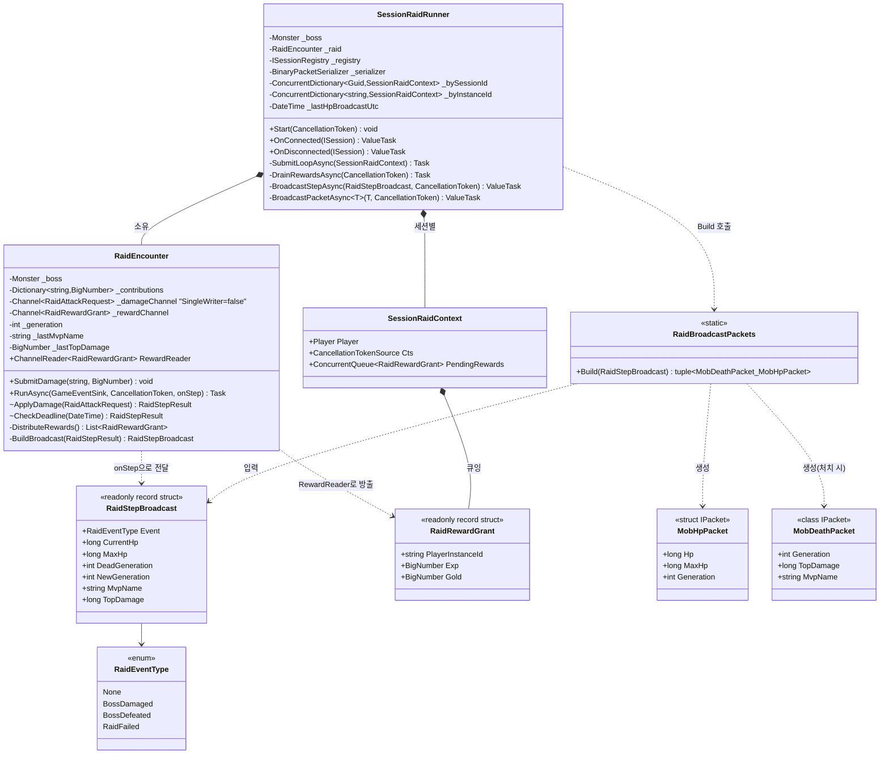
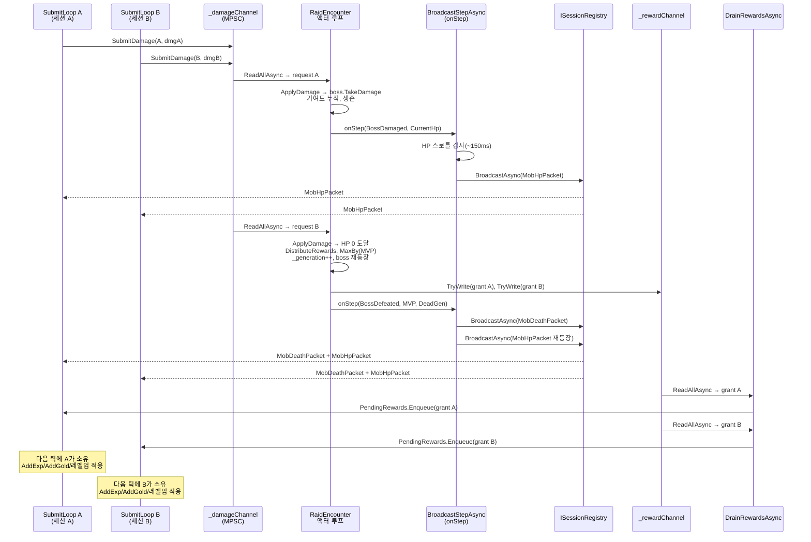
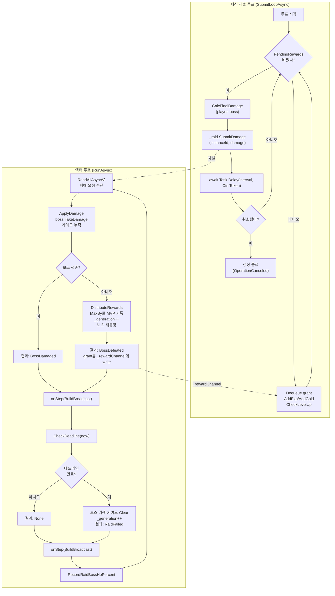

# 워크로그: 전투 멀티플레이 2단계 — 공유 보스 co-op 레이드

작성일: 2026-07-08
커밋 범위: `997349f..4a806d2` (6개 커밋)

## 1. 개요

이번 작업 사이클은 접속한 **모든 세션이 하나의 공유 레이드 보스(몬스터 7001)를 동시에 공격**하는
co-op 전투를 완성한 것이다. 직전 사이클(전투 멀티플레이 1단계, `SessionBattleRunner`)에서는 접속한
각 세션이 자신만의 독립 몬스터를 서버 자동 틱으로 사냥했다. 이번 사이클은 그 "세션별 격리" 구조를
"전원이 같은 보스 HP를 함께 깎고, 보스 HP·처치·MVP를 전 세션에 브로드캐스트하며, 처치 시 기여도
비례로 보상을 나누는" co-op 구조로 대체한다.

핵심은 새 도메인 로직을 처음부터 만드는 것이 아니라, **이미 존재하되 아무도 구동하지 않던 두
자산을 살려 배선**하는 것이었다. (1) `RaidEncounter`(단일 액터 루프가 여러 세션의 피해를 순차
처리하는 공유 보스 인코운터, 기여도 누적·비례 보상·재등장·제한시간 실패까지 단위 테스트가 이미
완비돼 있었다)를 다중 라이터로 확장하고 `onStep` 브로드캐스트 콜백을 추가했으며, (2) ServerLib의
`ISessionRegistry`/`BroadcastAsync` + `ServerNet.CreateSessionRegistry()` 경로(직전까지 `Main.cs`가
`registry=null`로 미사용)를 배선했다. 레이드 보스 마스터 데이터(7001, `Hp=5,000,000 · Atk=0 ·
Def=50`)도 이미 존재해 신규 데이터가 필요 없었다.

설계상 가장 무게가 실린 지점은 **동시성 안전**이다. 공유 보스 HP는 오직 `RaidEncounter`의 액터
루프 하나만 읽고 쓰며, 세션 제출 루프들은 보스의 불변 필드만 읽어 "피해 숫자"만 계산해 채널로
보낸다. 보상 크레딧도 단일 소유 원칙을 지켜, 드레인 루프는 grant를 세션별 큐에 enqueue만 하고
`Player`를 절대 직접 만지지 않으며, 그 Player를 소유한 세션 제출 루프만 경험치·골드·레벨업을
적용한다. 사이클 후반부에는 이번 사이클과 관련된 plan 문서 3종(`battle_system_0705`,
`battle_multiplayer_0708`, `battle_raid_coop_0708`)이 실제 코드와 일치하는지 감사하고, 발견된
드리프트를 원본 보존 + 날짜 찍힌 정정 섹션 관례로 바로잡았다.

## 2. 타임라인

| 순서 | 커밋 SHA | 한 줄 설명 | 성격 |
|------|----------|-----------|------|
| 1 | `997349f` | RaidEncounter에 다중 라이터(SingleWriter=false) + onStep 브로드캐스트 콜백 추가 | 구현(도메인 확장) |
| 2 | `1e932d7` | RaidBroadcastPackets — 레이드 스텝을 MobHpPacket/MobDeathPacket으로 매핑 | 구현(순수 매퍼) |
| 3 | `f1b7c51` | SessionRaidRunner — 공유 보스 co-op 네트워크 배선 | 구현(네트워크 계층) |
| 4 | `b73febd` | Main.cs를 공유 보스 co-op(SessionRaidRunner)로 교체 | 리팩토링(배선 교체) |
| 5 | `a9808f7` | 전투 멀티플레이 2단계 플랜 문서화 및 CLAUDE.md 갱신 | 문서(설계) |
| 6 | `4a806d2` | 전투 plan 문서 3종 드리프트 감사 및 정정 섹션 추가 | 문서(드리프트 정정) |

커밋 1→2→3은 의존 순서(도메인 → 매퍼 → 네트워크)를 그대로 따라 아래에서 위로 쌓았고, 4에서
`Main.cs` 배선을 교체해 실제로 구동되게 했다. 5는 설계 문서화, 6은 후속 드리프트 감사다.

## 3. 변경 사항 요약

### 신규 파일

- **`GameServer/Systems/RaidBroadcastPackets.cs`** (신규, 77줄) — `RaidStepBroadcast`(순수 도메인
  값)를 전 세션 브로드캐스트용 `(MobDeathPacket? Death, MobHpPacket Hp)`로 변환하는 `internal static`
  순수 매퍼. 소켓·I/O를 전혀 다루지 않고 ServerLib의 `ISession`도 모른 채 패킷 타입만 참조한다.
  `BossDefeated`일 때만 `Death`를 채우고(사망 패킷은 방금 끝난 `DeadGeneration`, 뒤이은 HP 패킷은
  재등장한 `NewGeneration`), 그 외 이벤트는 HP 패킷만 `NewGeneration`으로 채운다. HP는 방어적으로
  `Math.Max(0, ...)` 한 번 더 클램프한다.

- **`GameServer/Systems/SessionRaidRunner.cs`** (신규, 290줄) — `SessionPlayerBinder`와 나란히
  `ISession`을 다루는 두 번째(이자 마지막) 네트워크 계층 클래스. 생성 시 보스(7001)를 1회 스폰하고
  내부에 `RaidEncounter`를 소유한다. `Start()`가 레이드 액터 루프와 보상 드레인 루프를 각각
  `Task.Run`으로 기동하며, `OnConnected`/`OnDisconnected`가 세션별 제출 루프(`SubmitLoopAsync`)를
  시작·취소한다. `BroadcastStepAsync`(onStep 콜백)는 HP 전용 스텝을 ~150ms로 스로틀하고 처치/실패는
  즉시 브로드캐스트한다. `BroadcastPacketAsync`는 `ArrayPool<byte>.Shared`에서 버퍼를 대여해
  직렬화하고 `registry.BroadcastAsync` 완료까지 유효하게 유지한 뒤 `finally`에서 반납한다.

### 수정 파일

- **`GameServer/Systems/RaidEncounter.cs`** (수정, +163/-0 상당) — 순수 판정 코어
  (`ApplyDamage`/`CheckDeadline`/`DistributeRewards`)의 시그니처는 **완전히 그대로 유지**한 채,
  네트워크 계층이 필요로 하는 최소 확장만 비파괴적으로 얹었다. (1) `_damageChannel`을
  `SingleWriter=false`로 전환해 접속한 모든 세션이 동시에 `SubmitDamage`를 호출할 수 있게 했고(예전
  "정확히 한 샤드" 가정을 이 사이클에서 깸), (2) `RunAsync`에 선택적 `onStep` 콜백을 추가해 매 스텝
  직후 `RaidStepBroadcast`를 전달하고, (3) 콜백용 값 타입 `RaidStepBroadcast`(readonly record struct)와
  이를 만드는 `BuildBroadcast`를 신설했으며, (4) 세대 전환·MVP를 추적하는 액터 전용 private 상태
  (`_generation`/`_lastMvpName`/`_lastTopDamage`)를 추가했다. `ApplyDamage`는 처치 시 `MaxBy`로 최대
  기여자를 뽑아 MVP/TopDamage로 기록한 뒤 `_generation++` 한다.

- **`GameServer/Main.cs`** (수정, +69/-64 상당) — `SessionBattleRunner`(세션별 독립 몬스터) 배선을
  제거하고, `ServerNet.CreateSessionRegistry()`로 세션 레지스트리를 만들어 `SessionRaidRunner`와
  `CreateListener(registry)` 양쪽에 같은 인스턴스를 넘긴다. `raidRunner.Start(cts.Token)`로 액터·드레인
  루프를 먼저 기동한 뒤 리스너를 열어 첫 접속 전에 `SubmitDamage`를 받을 준비를 갖춘다. 연결 순서는
  `binder → raidRunner`, 해제 순서는 `raidRunner → binder`로 배선한다.

### 문서 파일

- **`plan/battle_raid_coop_0708.md`** (신규) — 이번 사이클의 설계 문서(배경·설계 결정 표·컴포넌트
  구조·핵심 API·변경 파일·빌드 검증·향후 확장).
- **`plan/battle_multiplayer_0708.md`**, **`plan/battle_system_0705.md`** (수정) — 실제 코드 대비
  드리프트(`BattleLoop.Run→RunAsync` 시그니처 변경, `LogTick`의 콘솔 출력이 `GameEventSink`로 대체,
  `Main.cs`가 `SessionRaidRunner`로 교체된 사실 미반영 등)를 원본 보존 + 날짜 찍힌 정정 섹션 관례로
  바로잡음.
- **`CLAUDE.md`** (수정) — 플랜 목록·예제 코드 위치(GameServer 요약)를 공유 보스 co-op 기준으로 갱신.

### 신규 테스트

- `RaidEncounterConcurrencyTests.cs` — 다중 라이터 동시 `SubmitDamage`(유실/중복 없음) 검증.
- `RaidEncounterBroadcastTests.cs` — `onStep`의 MVP/TopDamage/세대 전환 검증.
- `RaidBroadcastPacketsTests.cs` — 순수 매퍼 단위 테스트.
- `SessionRaidRunnerEndToEndTests.cs` — 실 루프백 소켓 2연결 co-op 통합 테스트(두 클라이언트가
  동일 바이트 시퀀스 수신).

## 4. 클래스 다이어그램

이번 사이클에서 신규/변경된 타입과 그 관계다. `RaidEncounter`(도메인, ServerLib 비참조)를
`RaidBroadcastPackets`(패킷 타입만 참조하는 순수 매퍼)가 변환하고, 그 위에서 `SessionRaidRunner`
(ISession/ISessionRegistry를 다루는 유일한 네트워크 계층)가 배선하는 3층 구조를 보여준다.

## 5. 시퀀스 다이어그램

두 클라이언트가 동시에 공유 보스를 공격해 처치에 이르는 런타임 호출 흐름이다. 세션 제출 루프는
피해 "숫자"만 채널로 보내고, 단일 액터 루프가 HP 변경·처치 판정·보상 분배를 순차 처리하며, onStep
콜백이 전 세션에 브로드캐스트하고, 드레인 루프가 보상을 각 세션 큐로 되돌리는 경로를 보여준다.

## 6. 순서도

두 개의 병렬 제어 흐름을 함께 그린다. 왼쪽은 세션 제출 루프(보상 소비 → 피해 계산 → 제출 → 대기),
오른쪽은 액터 루프의 스텝 판정(피해 적용 후 생존/처치 분기, 이어지는 데드라인 검사, HP% 기록)이다.

## 7. 검증 결과

- **빌드:** `dotnet build IDLE_RPG.sln` — 0 에러 / 0 경고(ServerLib의 기존 CS0419 경고 10건은 이번
  변경과 무관, 이전 사이클부터 존재).
- **단위/통합 테스트:** `GameServer.Tests` **144/144 통과**(신규 동시성 테스트 5회 연속, 신규 통합
  테스트 6회 연속 재실행 모두 플레이키 없음 확인). `EchoExample.Tests` 13/13 통과(회귀 없음).
- **런타임 스모크(공유 보스 실증):** `dotnet run --project GameServer`로 서버를 7777에 기동한 뒤 두
  개의 독립 raw TCP 소켓을 동시 접속해 각각 수신 바이트를 캡처, `diff` 결과 **두 캡처가 완전히
  바이트 단위로 동일**함을 확인했다 — 두 클라이언트가 같은 공유 보스의 `MobHpPacket` 시퀀스
  (MaxHp=5,000,000, HP가 두 플레이어의 기여로 함께 감소)를 실제 네트워크 위에서 수신했음을 실증.
  `logs/game-events.ndjson`에 서로 다른 `playerId` 2개의 `PlayerConnected`/`PlayerDisconnected`가
  정상 기록됨을 확인.
- **드리프트 감사(커밋 6):** Explore 에이전트로 관련 plan 3종을 실제 코드와 대조 —
  `battle_raid_coop_0708.md`는 드리프트 없음, `battle_system_0705.md`·`battle_multiplayer_0708.md`는
  여러 드리프트(BattleLoop 시그니처, 콘솔→GameEventSink 전환, Main.cs 배선 교체)를 발견해
  `gameserver_domain_scaffold_0704.md §8`과 동일한 관례(원본 보존 + 날짜 찍힌 정정 섹션)로 정정.

## 8. 관련 문서 링크

- [plan/battle_raid_coop_0708.md](../plan/battle_raid_coop_0708.md) — 이번 사이클의 설계 문서(신규)
- [plan/battle_multiplayer_0708.md](../plan/battle_multiplayer_0708.md) — 전투 멀티플레이 1단계 설계(드리프트 정정 섹션 추가)
- [plan/battle_system_0705.md](../plan/battle_system_0705.md) — 방치형 전투 플로우 설계(드리프트 정정 섹션 추가)
- [plan/client_server_split_0708.md](../plan/client_server_split_0708.md) — 클라-서버 분리 1단계(배경)
- [CLAUDE.md](../CLAUDE.md) — 플랜 목록·GameServer 예제 코드 위치 갱신

## 9. 향후 과제

- **브로드캐스트를 액터 루프에서 분리** (v1 알려진 한계): 현재 `onStep`은 액터의 `await foreach`
  안에서 동기적으로 `await`되어, 한 세션의 전송 지연이 보스 처리 전체를 잠시 멈출 수 있다. 별도
  채널 + 드레인 태스크로 액터를 네트워크 I/O에서 완전히 분리하는 개선이 다음 사이클 과제다.
- **브로드캐스트 스로틀 정교화**: HP diff 임계·적응형 주기 도입, 신규 접속자에게 현재 보스 HP
  스냅샷 1회 즉시 푸시(현재는 다음 브로드캐스트까지 HP를 모름).
- **보스 페이즈/버프**: 현재 불변식상 생성 후 `boss.Update`/`UpdateFinalStats` 호출 금지(세션 제출
  루프들이 동시에 읽는 `Def`/`CombatTraits` 재기록 레이스 방지). 페이즈 도입 시 액터 단일 스레드에서만
  재계산하도록 재설계 필요. `SubmitLoopAsync`도 현재 `player.Update`를 호출하지 않는다(보스 무반격).
- **아이템 드롭 분배**: 현재 레이드는 Exp/Gold만 기여 비례 분배하고 `AcquiredItems`는 미분배.
- **PvP·실제 로그인·스테이지/스포너**: 현재도 로그인 없이 `SessionPlayerBinder`가 임시 Player
  (`AccountId=0`)를 생성하고 보스(7001)·시작 장비(4001/5001/6001)가 고정값이다.
