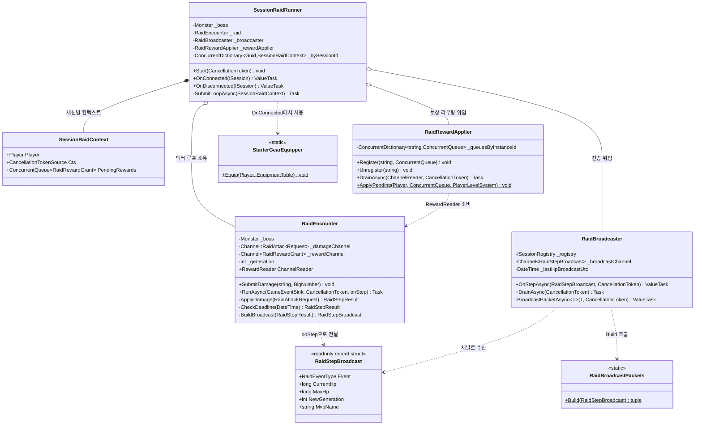
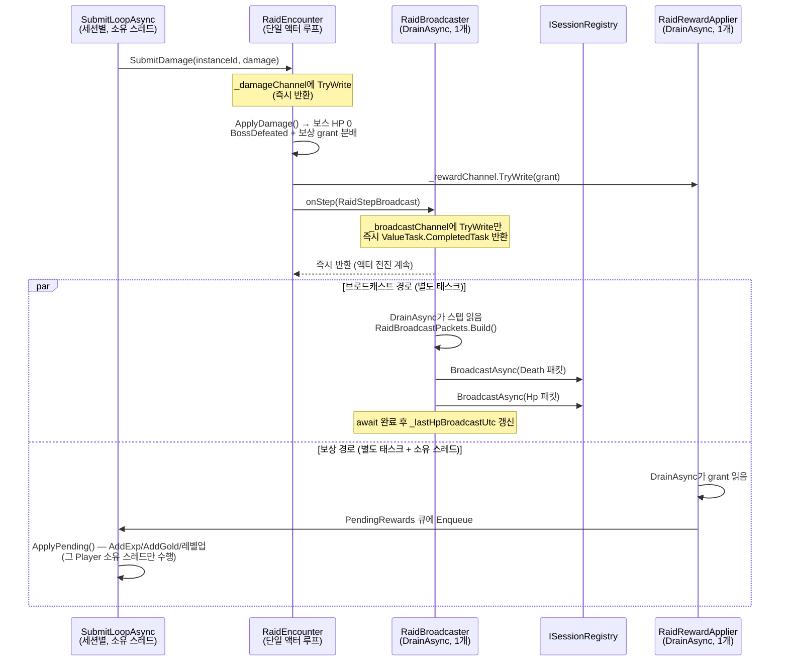
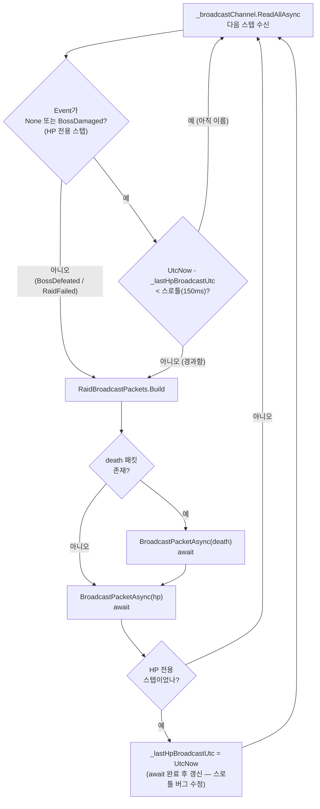

# 워크로그: 공유 보스 co-op 코드리뷰 후속 수정 사이클 (2026-07-09)

## 1. 개요

직전 워크로그([battle_raid_coop_0708.md](battle_raid_coop_0708.md), 커밋 `804ab85`까지)에서
"접속한 모든 플레이어가 하나의 공유 레이드 보스(몬스터 7001)를 동시에 공격하는" co-op 전투를
1차 구현했다. 그 산출물을 대상으로 `comprehensive-review` 스킬이 종합 코드 리뷰를 실행해
[docs/code-reviews/2026-07-08-shared-boss-raid-coop-review.md](../docs/code-reviews/2026-07-08-shared-boss-raid-coop-review.md)를
남겼고, HIGH 1건 · Medium 6건 · Low 12건이 지적됐다.

이 사이클은 그 리뷰 발견들을 **심각도 순으로 후속 수정**한 전체 흐름이다. 핵심은 세 가지다.

- **HIGH(성능/보안/아키텍처가 같은 근본 원인을 서로 다른 렌즈로 지적):** 느리거나 정지된
  클라이언트 1명이 `registry.BroadcastAsync`를 무한 대기시키면 **레이드 액터 루프 전체가 함께
  정지**하고, 그동안 무경계 `_damageChannel`이 무한히 쌓여 OOM으로 이어질 수 있었다.
  브로드캐스트를 액터 루프에서 완전히 분리해 해소했다.
- **Medium(SRP 위반 등):** 300줄에 6가지 책임이 뒤섞인 `SessionRaidRunner`를
  `RaidBroadcaster`/`RaidRewardApplier`로 분리하고, `Task.Delay` 반복 할당을 `PeriodicTimer`로
  교체하고, 분리 덕에 가능해진 회귀 테스트를 추가했다.
- **문서 드리프트 감사(코드-문서 대조 검증)의 반복:** 코드를 여러 커밋에 걸쳐 편집하면서
  앞 커밋의 XML 문서 주석이 뒤 커밋의 코드 변경을 반영하지 못한 채 남는 드리프트가 반복
  발생했고, 이를 매번 grep/Read로 직접 대조해 정정하는 감사 사이클이 세 차례 돌았다.

## 2. 타임라인

시간순(오래된 → 최신). 성격은 리뷰 발견의 심각도 처리 순서(HIGH → Medium → Low → 검증 감사)를 따른다.

| # | 커밋 | 한 줄 설명 | 성격 |
|---|------|-----------|------|
| 1 | `b874793` | 공유 보스 co-op 종합 코드 리뷰 리포트 추가 | 리뷰(기준점) |
| 2 | `9f552d0` | **HIGH 수정** — 브로드캐스트를 레이드 액터 루프에서 분리(+성능/보안 Medium 동시 해소) | 버그수정 |
| 3 | `d3ef8e6` | Medium 수정 — `SessionRaidRunner` `PeriodicTimer` 전환 및 XML 문서 보강 | 수정 |
| 4 | `7f3ccba` | Medium 수정 — SRP 위반 해소, `RaidBroadcaster`/`RaidRewardApplier` 분리 | 리팩토링 |
| 5 | `a229954` | 분리로 가능해진 방어적 분기·스로틀·보상 라우팅 회귀 테스트 추가 | 테스트 |
| 6 | `595d604` | Medium 발견 후속 수정 결과를 플랜·코드리뷰 문서에 반영 | 문서 |
| 7 | `aee13b2` | Low 발견 6건 정리(인라인 주석·중복 추출·named 인자·낡은 문서 정정) | 리팩토링 |
| 8 | `84181cf` | Low 발견 후속 수정 결과를 플랜·코드리뷰 문서에 반영 | 문서 |
| 9 | `f3a908a` | **문서 드리프트 감사** — 깨진 `<see cref>` 3건 발견 및 정정 | 문서 |

**HIGH가 왜 먼저였나(#2):** 리뷰에서 성능=HIGH, 보안=Medium(CWE-400 무경계 리소스 소비),
아키텍처=Low가 **서로 다른 세 렌즈로 같은 결함**을 독립 지적했다 — "액터 루프가 브로드캐스트를
직접 동기 `await`한다"는 단일 근본 원인. 하나의 느린 피어가 전체 co-op 전투를 멈추고 메모리를
고갈시키는 가용성 위협이라 가장 먼저, 단독 커밋으로 고쳤다. 같은 커밋에서 스로틀 타임스탬프
순서 버그(성능 Medium)와 `SessionSendTimeout` 미설정(보안 Medium)도 같은 코드 경로라 함께 닫았다.

**SRP 분리가 왜 그다음이었나(#3→#4→#5):** HIGH 수정으로 도입된 "액터-전송 분리" 패턴(별도 드레인
태스크) 때문에 `SessionRaidRunner`가 더 비대해졌다. 먼저 `PeriodicTimer` 전환·문서 보강 같은
국소 Medium(#3)을 처리한 뒤, 비대해진 클래스를 3개로 쪼개는 큰 구조 변경(#4)을 하고, 쪼개진
독립 클래스 덕분에 `ISession` 전체를 흉내 내지 않고도 검증 가능해진 분기들에 회귀 테스트(#5)를
추가하는 순서로 진행했다.

**문서 드리프트 감사가 어떻게 반복됐나(#6, #8, #9):** 코드 수정 커밋마다(#3/#4/#5) `SessionRaidRunner.cs`를
편집했는데, 매 수정 직후 리뷰 문서·플랜 문서에 "해소/보류/반려"를 즉시 기록하는 감사를
돌렸다(#6 Medium, #8 Low). 그런데 마지막 검증 감사(#9)에서 **문서에 적어둔 주장이 실제 코드와
정말 일치하는지**를 grep/Read로 재대조하자, 세 번의 개별 커밋에 걸쳐 `SessionRaidRunner.cs`를
편집하면서 앞 커밋의 `<see cref>`가 뒤 커밋의 코드 이동을 따라가지 못한 깨진 참조 3건이 드러났다.
`GameServer.csproj`에 `GenerateDocumentationFile`이 없어 컴파일러가 cref 미해결을 검증하지 않아
`dotnet build`가 조용히 통과했기 때문에, 직접 대조 없이는 드러나지 않는 드리프트였다.

## 3. 변경 사항 요약

### HIGH 수정 (#2 `9f552d0`)

- **`GameServer/Systems/SessionRaidRunner.cs`** — `onStep` 콜백을 신규 `_broadcastChannel`에
  `TryWrite`만 하는 트리비얼 패스스루로 바꾸고, 실제 전송·HP 스로틀 판정을 별도 드레인 태스크로
  분리(이 시점엔 아직 `SessionRaidRunner` 내부에 있었고, #4에서 `RaidBroadcaster`로 이동). 스로틀
  타임스탬프를 `await` 완료 **이후**로 이동(이전엔 이전에 찍어 느린 브로드캐스트에서 무력화됨).
- **`GameServer/Main.cs`** — `listener.SessionSendTimeout = TimeSpan.FromSeconds(2)` 추가.
  미설정(기본 무한 대기)이면 수신 버퍼를 비우지 않는 정지 피어가 `BroadcastAsync`를 영원히
  붙잡으므로, 유한값으로 시한 초과 시 그 세션 송신만 끊고 나머지 브로드캐스트는 계속되게 한다.
- **`tests/GameServer.Tests/Systems/SessionRaidRunnerBroadcastDecouplingTests.cs`** (신규) —
  브로드캐스트가 절대 반환하지 않는 가짜 레지스트리를 주입해도 액터가 계속 전진함을 직접 검증.

### Medium 수정 (#3 `d3ef8e6`, #4 `7f3ccba`, #5 `a229954`)

- **`GameServer/Systems/SessionRaidRunner.cs`** — `SubmitLoopAsync`의 매 틱 `Task.Delay(interval, token)`을
  `PeriodicTimer` 재사용으로 교체(세션당 병렬 루프라 접속자가 많을수록 타이머 등록/해제 오버헤드
  절감). 이후 #4에서 세션 생명주기 + 제출 루프 오케스트레이션만 남기고 184→약 70줄 규모로 축소.
- **`GameServer/Systems/RaidBroadcaster.cs`** (신규, #4) — `onStep` 콜백 수신 + 채널 드레인 +
  직렬화/스로틀/네트워크 전송. HIGH 수정에서 도입한 액터-전송 분리 패턴을 그대로 계승해 독립 클래스화.
- **`GameServer/Systems/RaidRewardApplier.cs`** (신규, #4) — `PlayerInstanceId → PendingRewards` 큐
  라우팅(드레인 루프) + 정적 `ApplyPending` 헬퍼(각 세션 소유 스레드가 직접 호출). 부수 효과로
  `SessionRaidRunner`의 `_byInstanceId` 중복 인덱스 제거.
- **테스트 3종 신규**(#5) — `RaidBroadcasterTests`(스로틀 경계, 처치는 항상 Death+Hp 2건),
  `RaidRewardApplierTests`(등록 라우팅·미등록 드롭·Unregister 차단·dequeue-and-apply),
  `SessionRaidRunnerEdgeCaseTests`(Player 컨텍스트 없음·중복 SessionId·중복 해제 = 조용한 no-op).

### Low 수정 (#7 `aee13b2`)

- **`GameServer/Systems/RaidBroadcaster.cs`** — `ArrayPool.Rent` 선언에 CLAUDE.md가 요구하는
  내부 동작 근거 인라인 주석 추가.
- **`GameServer/Systems/StarterGearEquipper.cs`** (신규) — `SessionRaidRunner`/`SessionBattleRunner`가
  verbatim 중복으로 들고 있던 시작 장비(4001/5001/6001) 착용 로직을 공용 헬퍼로 추출.
- **`GameServer/Systems/RaidEncounter.cs`** — `RunAsync`의 `damageStep`/`deadlineStep` 두 블록에서
  반복되던 "이벤트 기록 + `onStep` 통지"를 `EmitAndBroadcastAsync` 로컬 함수로 통합, `BuildBroadcast`의
  `RaidStepBroadcast` 생성자 호출을 전부 named 인자로 전환, `onStep` XML 문서의 "차후 분리 예정"
  낡은 서술을 현재 계약(즉시 반환)으로 정정.
- **`tests/GameServer.Tests/Systems/RaidTestBoss.cs`** (신규) — 두 테스트 파일이 중복하던
  `MakeBoss` 헬퍼를 공용 클래스로 추출.

### 문서 (#6, #8, #9)

- **`docs/code-reviews/2026-07-08-shared-boss-raid-coop-review.md`** — Medium/Low 각 항목에
  해소/보류/반려 여부와 근거 기록.
- **`plan/battle_raid_coop_0708.md`** — SRP 분리 이후 컴포넌트 구조·의존 관계·변경 파일 목록 갱신,
  §8 "구현 상태 검증" 섹션 신설(Medium 6 + Low 12 델타표).
- **`GameServer/Systems/SessionRaidRunner.cs`** (#9, 순수 문서 변경) — 깨진 `<see cref>` 3건 정정:
  `DrainRewardsAsync → RaidRewardApplier.DrainAsync`, `Task.Delay(...) → PeriodicTimer.WaitForNextTickAsync`,
  삭제된 `_byInstanceId` 필드 참조 제거.

## 4. 클래스 다이어그램

SRP 분리 이후 현재 저장소에 존재하는 공유 보스 co-op 타입 구조. `SessionRaidRunner`는 세션
생명주기와 제출 루프 오케스트레이션만 남기고, 브로드캐스트는 `RaidBroadcaster`, 보상 라우팅은
`RaidRewardApplier`, 보스 HP 판정은 `RaidEncounter`가 각각 단일 책임으로 나눠 가진다.

## 5. 시퀀스 다이어그램

보스 처치 1회가 일어나는 런타임 흐름. 핵심은 **액터 루프(`RaidEncounter.RunAsync`)가 브로드캐스트를
직접 기다리지 않는다**는 점이다 — `onStep`은 채널에 쓰기만 하고 즉시 반환하며, 실제 네트워크 전송과
보상 적용은 각각 별도의 드레인 태스크/소유 스레드에서 비동기로 흘러간다.

## 6. 순서도

`RaidBroadcaster.DrainAsync`의 제어 흐름. HIGH 수정으로 이 로직이 액터 루프에서 완전히 떨어져
나왔고, Medium 수정으로 스로틀 타임스탬프 갱신 위치가 `await` **이후**로 옮겨졌다. 처치/실패는
항상 즉시 전송하고, 생존/무이벤트 HP 스텝만 스로틀 대상이 된다.

## 7. 검증 결과

- **종합 코드 리뷰(기준점, #1):** [docs/code-reviews/2026-07-08-shared-boss-raid-coop-review.md](../docs/code-reviews/2026-07-08-shared-boss-raid-coop-review.md)
  — HIGH 1건 · Medium 6건 · Low 12건. 이 사이클에서 HIGH 1 + Medium 6 전부 해소, Low는 값싸고
  안전한 6건 해소 + 나머지 6건은 설계 트레이드오프/비용 대비 보류 또는 의도된 동작으로 반려.
- **테스트:** 사이클 시작 시 `GameServer.Tests` 145/145 → 회귀 테스트 9건 신규(#5) 추가로 154/154
  통과. Raid 관련 31건을 3회 반복 실행해 타이밍 관련 플레이키니스 없음 확인. 신규 테스트도
  5회 반복 무플레이키 확인.
- **빌드:** 각 수정 커밋에서 `dotnet build` 0 오류.
- **동작 보존 검증:** #3/#4/#7은 동작 보존 리팩토링으로, 신규 테스트 없이 기존 테스트 전량 통과로
  회귀 검증. HIGH 수정(#2)만 새 동작(액터-전송 분리)을 도입하므로 전용 회귀 테스트를 함께 추가.
- **문서 드리프트 감사(#9):** `dotnet build`가 통과하는데도 `<see cref>` 3건이 깨져 있었음 —
  `GameServer.csproj`에 `GenerateDocumentationFile`이 없어 컴파일러가 cref 미해결을 검증하지
  않기 때문. grep/Read 직접 대조로만 잡히는 드리프트였고, 세 곳 모두 순수 문서 변경으로 정정
  (동작 무변화), 정정 후 154/154 재확인.

## 8. 관련 문서 링크

- [plan/battle_raid_coop_0708.md](battle_raid_coop_0708.md) — 공유 보스 co-op 설계.
  §8 "2026-07-09 구현 상태 검증(코드리뷰 Medium/Low 후속 수정 감사)"에 최신 델타표 포함.
- [docs/code-reviews/2026-07-08-shared-boss-raid-coop-review.md](../docs/code-reviews/2026-07-08-shared-boss-raid-coop-review.md)
  — 이 사이클의 기준점이 된 종합 코드 리뷰. Medium/Low 각 항목에 해소/보류/반려 근거가 기록됨.
- [worklog/battle_raid_coop_0708.md](battle_raid_coop_0708.md) — 직전 사이클(1차 구현) 워크로그.

## 9. 향후 과제

리뷰에서 지적됐으나 이번 사이클에서 **의도적으로 남긴** 항목들.

- **아키텍처 Medium — `Systems/` 폴더 물리적 분리:** 사용자 확인 결과 이번 사이클 범위 밖으로
  판단해 보류.
- **아키텍처 Medium — `MobHpPacket`/`MobDeathPacket`을 ServerLib → GameServer로 이관:** 도메인
  패킷을 네트워크 라이브러리에서 게임 서버로 옮기는 결정이라 별도 사이클로 보류.
- **Low 보류 6건:** `_boss` 이중 소유(`SessionRaidRunner`와 `RaidEncounter`가 같은 인스턴스 참조),
  판정 코어의 브로드캐스트 상태 혼입, 구체 클래스 직접 참조(DIP), 연결 상한 없음, 생성자 파라미터
  7개 — 실제 설계 트레이드오프이거나 Low 심각도 대비 수정 비용이 커 보류.
- **Low 반려 1건:** 보스 HP 게이지가 스로틀을 우회하는 것은 **의도된 동작**(무조건적 liveness
  신호이며 `SessionRaidRunnerBroadcastDecouplingTests`가 이 특성에 의존)이라 반려.
- **`SubmitLoopAsync`의 범용 예외 캐치 분기(`RecordPlayerConnectionError`) 미테스트:** 프로덕션
  의존성(`BattleManager`/`Player`)에 인위적 결함을 주입해야만 트리거 가능해 이번 범위 제외 —
  코드 검토로 충분히 확인됨(Medium 심각도 대비 과잉 테스트 비용).
- **`GenerateDocumentationFile` 부재:** cref 드리프트가 빌드에서 잡히지 않는 근본 원인. 활성화하면
  향후 문서 드리프트를 컴파일 타임에 방어할 수 있으나, 기존 경고량·CI 정책 검토가 선행돼야 함.
- **다음 기능 사이클:** PvP, 실제 로그인, 보스 페이즈(1차 설계 문서 기준 미착수).
