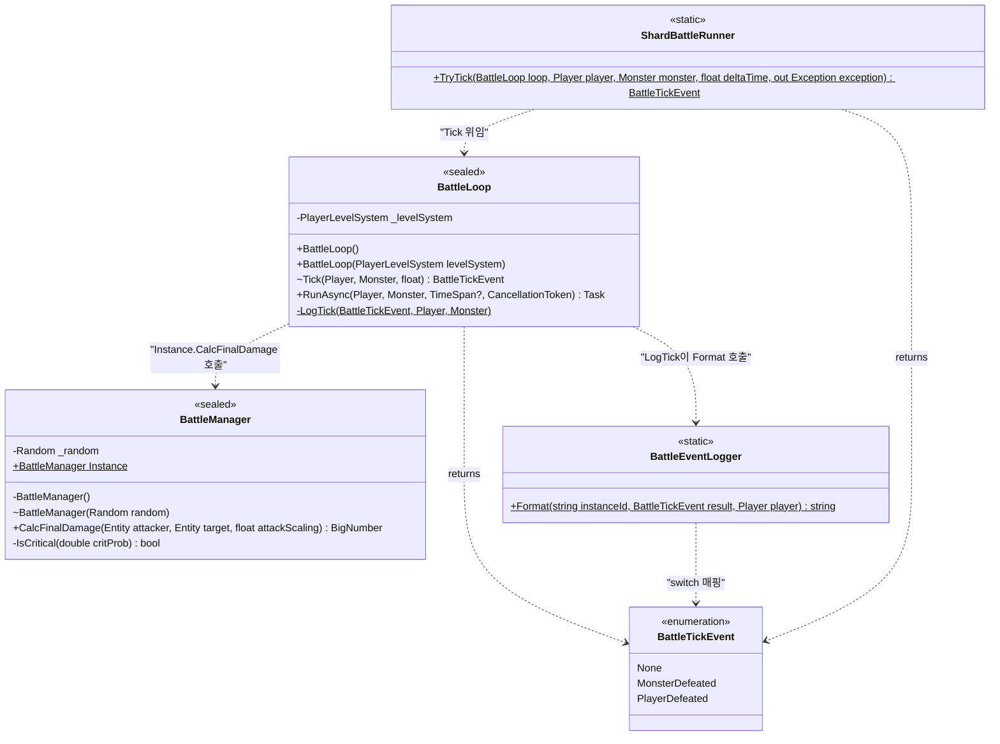
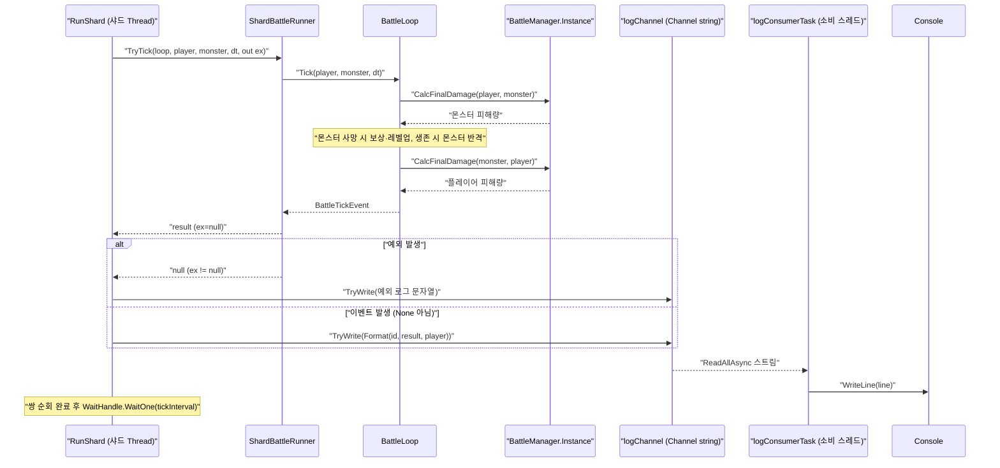
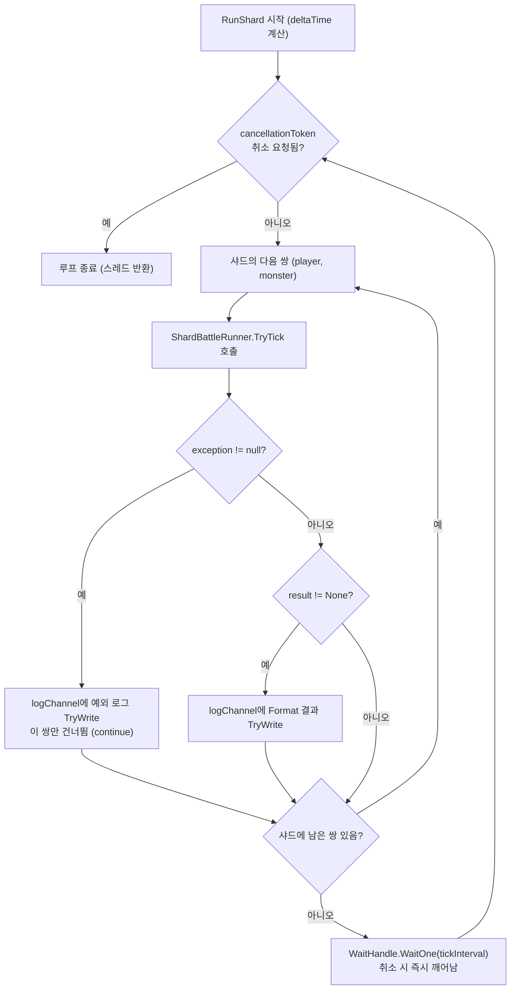

# 워크로그 — 다중 플레이어 배틀 스레드 샤딩 (2026-07-07)

**커밋 범위:** `299b4b1..7eb5b66`
**대상 브랜치:** claude

---

## 1. 개요

지금까지 `GameServer/Systems/BattleLoop.cs`는 **단일 Player vs 단일 Monster** 라운드제 무한 루프로
스코프가 좁혀져 있었고(`plan/battle_system_0705.md` §8에서 "멀티플레이 접점은 범위 밖"으로 명시),
`GameServer/Main.cs`도 플레이어 1명·몬스터 1마리를 `BattleLoop.RunAsync` 하나로 돌리는 데모였다.

이번 사이클의 목적은 **서버에 다수의 플레이어가 동시 접속해 각자 독립적으로 전투를 진행하는 상황**을
시뮬레이션하는 것이다. 실제 네트워크 세션 계층(TCP/WebSocket 리스너)은 아직 없으므로,
`Main.cs` 데모를 확장해 `ThreadCount`(조정 가능 상수) × `PlayersPerThread`(100 고정)명의
Player/Monster 쌍을 만들고, 이를 `ThreadCount`개의 샤드로 나눠 **샤드마다 전용 `Thread`**가
자기 몫 100명을 동기 순회하며 전투를 진행하게 했다. 플레이어 간 상호작용(파티/PvP)은 없는 완전
독립 전투다.

핵심 도메인 변경은 세 가지다. (1) 여러 샤드 스레드가 `BattleManager.Instance`를 동시 호출하므로
내부 난수원을 `Random.Shared`로 전환해 스레드 안전을 확보했다. (2) 전용 스레드의 미처리 예외가
프로세스 전체를 종료시키는 위험을 막기 위해 `ShardBattleRunner.TryTick`으로 틱 호출을 **쌍 단위로
격리**했다. (3) 스레드당 100명 규모에서 매 틱 HP 로그가 콘솔을 넘치게 하지 않도록,
`BattleEventLogger`로 처치/사망 이벤트만 포맷하는 순수 함수를 분리했다.

이후 커밋 범위 안에서 종합 코드 리뷰(79.3점, REQUEST CHANGES)를 실행해 High 2건을 후속 수정했다:
Ctrl+C 협조적 취소를 위한 `CancellationToken` 복원, 그리고 모든 샤드 스레드가 `Console.WriteLine`
전역 락에서 경합하던 병목을 `Channel<string>` 기반 단일 로그 소비 스레드로 우회한 것이다.

---

## 2. 타임라인

| # | 커밋 SHA | 한 줄 설명 | 성격 |
|---|----------|-----------|------|
| 1 | `1b8dbd3` | 다중 플레이어 배틀 스레드 샤딩 설계 문서 추가 | 설계 |
| 2 | `9b25bbf` | 4단계 TDD 구현 계획 문서 추가 | 계획 |
| 3 | `03e65dd` | BattleManager 기본 경로를 `Random.Shared`로 전환 | 구현 |
| 4 | `ca7d48b` | `_random` 필드 인라인 주석을 `Random.Shared` 반영으로 정정 | 문서 |
| 5 | `994cd6d` | `BattleEventLogger` — 이벤트 전용 로그 포맷터 추가 | 구현 |
| 6 | `47cb5f7` | `ShardBattleRunner` — Tick 예외 쌍 단위 격리 추가 | 구현 |
| 7 | `46b546a` | Main.cs를 스레드 샤딩 데모로 교체 | 구현 |
| 8 | `a372b54` | 최종 리뷰 Minor 지적사항 정리 | 수정 |
| 9 | `2b8b08a` | claude 브랜치를 master로 병합 (샤딩 기능 통합) | 병합 |
| 10 | `7aa1826` | 종합 코드리뷰 결과를 `docs/code-reviews/`에 보존 | 문서 |
| 11 | `7eb5b66` | 코드리뷰 High 2건 수정 — 샤드 취소 복원 · 콘솔 락 경합 제거 | 리뷰수정 |

작업 순서: 설계(브레인스토밍) → 계획(4단계 TDD) → TDD 구현(BattleManager → BattleEventLogger →
ShardBattleRunner → Main.cs) → 최종 리뷰 Minor 정리 → 병합 → 종합 리뷰 실행·보존 → High 2건 후속 수정.

---

## 3. 변경 사항 요약

### 신규 파일

- **`GameServer/Systems/BattleEventLogger.cs`** (커밋 5)
  `static` 클래스. `Format(instanceId, result, player)`가 `BattleTickEvent`를 사람이 읽을 한 줄
  로그 문자열로 변환하는 순수 함수다. `MonsterDefeated`/`PlayerDefeated`는 `[player-XXXX]` 프리픽스가
  붙은 문자열, `None`은 `string.Empty`를 반환해 "출력하지 말라"는 신호를 준다. 공유 가변 상태가 없어
  여러 샤드 스레드가 동시에 호출해도 안전하다.

- **`GameServer/Systems/ShardBattleRunner.cs`** (커밋 6)
  `static` 클래스. `TryTick(loop, player, monster, deltaTime, out exception)`이 `BattleLoop.Tick`
  1회 호출을 `try/catch`로 감싼다. 정상 시 `BattleTickEvent?`를 반환하고 `exception`은 null,
  예외 시 null을 반환하고 `exception`에 잡은 예외를 실어 보낸다. **왜 필요한가:** 전용 `Thread`의
  미처리 예외는 백그라운드 여부와 무관하게 프로세스 전체를 종료시키므로, 한 쌍의 실패가 나머지
  플레이어까지 죽이지 않도록 쌍 단위로 예외를 잡아 격리한다.

### 수정 파일

- **`GameServer/Systems/BattleManager.cs`** (커밋 3·4)
  기본 생성자를 `private BattleManager() : this(Random.Shared)`로 바꿔, 여러 샤드 스레드의 동시
  `CalcFinalDamage` 호출을 스레드 안전하게 만들었다. `internal BattleManager(Random random)` 시드
  주입 생성자는 그대로 유지해 기존 결정적 테스트에 영향을 주지 않는다. `_random` 필드 인라인 주석도
  "기본 경로는 스레드 안전, 시드 주입 경로만 단일 스레드 전용"으로 정정해 클래스 `<remarks>`와 일치시켰다.

- **`GameServer/Main.cs`** (커밋 7·8·11)
  단일 Player-vs-Monster `RunAsync` 데모를 스레드 샤딩 데모로 전면 교체했다. `ThreadCount`(=4,
  조정 가능) × `PlayersPerThread`(=100 고정)명의 쌍을 생성해 `ThreadCount`개 샤드로 파티셔닝하고,
  샤드마다 `IsBackground=true` 전용 `Thread`를 띄운다. 커밋 11(리뷰 High 2건 수정)에서 두 가지가
  추가됐다: (1) `CancellationTokenSource` + `Console.CancelKeyPress`로 Ctrl+C 협조적 취소를 복원해
  `RunShard`가 `cancellationToken.WaitHandle.WaitOne(tickInterval)`로 대기하다 취소 시 스스로 종료.
  (2) 각 샤드가 직접 `Console.WriteLine`하던 것을 `Channel.CreateUnbounded<string>`(lock-free MPSC,
  SingleReader)에 문자열만 넣고, 단일 `logConsumerTask`가 소비해 출력하도록 바꿔 콘솔 전역 락 경합을 제거했다.

- **`GameServer/Systems/BattleLoop.cs`** (커밋 11)
  `LogTick`이 처치/사망 포맷을 자체 `switch`로 중복 계산하던 부분을 `BattleEventLogger.Format`
  호출로 통합했다(포맷 로직 단일화). `None`(HP 상태 줄)은 단일 페어 데모인 `RunAsync` 경로에서만
  별도 출력한다. `Tick`/`RunAsync`의 시그니처·동작은 그대로다.
  (참고: 설계 문서 §7은 "BattleLoop.cs 변경 없음"이라 적었으나, 리뷰 수정으로 최종 범위에서는
  `LogTick`이 실제로 바뀌었다 — 다이어그램·서술은 최종 코드 기준이다.)

### 기타

- **테스트:** `BattleEventLoggerTests.cs`, `ShardBattleRunnerTests.cs` 신규 추가,
  `BattleManagerTests.cs`에 `Random.Shared` 검증 테스트 추가, `GlobalUsings.cs`에 using 1건 추가.
- **문서:** 설계 spec / 구현 plan / 코드리뷰 리포트를 저장소에 커밋(`_workspace/` gitignore로 인한
  리뷰 결과 유실 재발 방지), `CLAUDE.md` 1줄 갱신.

---

## 4. 클래스 다이어그램

이번 사이클에서 신규/변경된 타입들의 구조와 관계다. `BattleEventLogger`와 `ShardBattleRunner`는
상태 없는 `static` 유틸이고, `BattleManager`는 `Random.Shared`를 주입받는 싱글턴, `BattleLoop`은
샤드가 공유하는 무상태 전투 로직이다.

---

## 5. 시퀀스 다이어그램

`Main.cs`의 한 샤드 스레드가 자기 몫의 한 쌍을 한 틱 처리하는 런타임 호출 흐름이다. 로그는
직접 콘솔에 쓰지 않고 `Channel`을 거쳐 단일 소비 스레드가 출력한다(리뷰 성능 High 수정의 핵심).

---

## 6. 순서도

`RunShard`의 제어/의사결정 흐름이다. 취소 토큰을 매 틱 확인하고, 쌍마다 예외/이벤트를 분기 처리하며,
`WaitHandle.WaitOne`으로 취소를 감시하면서 대기한다(취소 시 즉시 깨어나 루프 종료).

---

## 7. 검증 결과

### 빌드 · 테스트

- `dotnet test tests/GameServer.Tests/GameServer.Tests.csproj` 실행 결과:
  **통과 105 / 실패 0 / 건너뜀 0 / 전체 105** (net10.0, 약 258ms).
- 신규 테스트: `BattleEventLoggerTests`(포맷 매핑·`None`→빈 문자열), `ShardBattleRunnerTests`(정상
  틱 반환·예외 격리·`out exception` 신호), `BattleManagerTests`(기본 경로가 `Random.Shared`를
  참조하는지 리플렉션 검증).

### 종합 코드 리뷰

`code-review-orchestrator`를 `299b4b1..2b8b08a`(병합 시점, High 2건 수정 **이전**)에 실행:

| 도메인 | 점수 | Critical | High | Medium | Low |
|--------|------|----------|------|--------|-----|
| 아키텍처 | 70 | 0 | 2 | 2 | 1 |
| 보안 | 90 | 0 | 0 | 0 | 4 |
| 성능 | 72 | 0 | 1 | 2 | 3 |
| 스타일 | 82 | — | 0 | 2 | 6 |
| **종합** | **79.3** | **0** | **3** | **6** | **14** |

**판정: REQUEST CHANGES** (High 3건 + 79.3점, 60–79 구간. Critical 없어 BLOCK 아님)

### 리뷰 High 2건 후속 수정 (커밋 `7eb5b66`)

리뷰 판정은 병합 시점 기준이며, 지목된 High 2건은 커밋 범위 마지막 커밋에서 **모두 해소**됐다:

1. **[아키텍처 High] 취소 모델 유실** → `Main.cs`에 `CancellationTokenSource`와
   `Console.CancelKeyPress` 핸들러를 되살려, Ctrl+C 시 각 샤드가 `WaitHandle.WaitOne`에서 깨어나
   협조적으로 종료하도록 복원. 포맷 이중화는 `BattleLoop.LogTick`을 `BattleEventLogger.Format`으로
   통합해 해소(리뷰가 제안한 `RunAsync` 일반화·`LogTick` 제거 대신, `LogTick`을 남기되 포맷만 위임).
2. **[성능 High] 콘솔 전역 락 경합** → 샤드 스레드의 직접 `Console.WriteLine`을
   `Channel<string>`(lock-free MPSC) + 단일 로그 소비 스레드로 우회해 샤딩 병렬성 상쇄 병목 제거.

---

## 8. 관련 문서 링크

- [설계 spec — 다중 플레이어 배틀 스레드 샤딩 모델](../docs/superpowers/specs/2026-07-07-multi-player-battle-sharding-design.md)
- [구현 plan — 4단계 TDD 구현 계획](../docs/superpowers/plans/2026-07-07-multi-player-battle-sharding.md)
- [종합 코드리뷰 리포트](../docs/code-reviews/2026-07-07-multi-player-battle-sharding-review.md)

---

## 9. 향후 과제

리뷰에서 나온 미해결 Medium/Low 및 설계 문서가 명시한 확장 포인트를 부채로 기록한다.

### 리뷰 미해결 항목 (이번 사이클 범위 밖으로 이월)

- **[아키텍처 Medium]** 샤딩 오케스트레이션(파티셔닝 산술·Thread 수명·샤드 루프)이 테스트 불가능한
  `Main.cs`에 상주 → `BattleShardScheduler` 같은 1급 서비스로 추출해 단위 테스트 가능하게.
- **[아키텍처 Medium]** `BattleLoop`이 정적 싱글턴 `BattleManager.Instance`에 하드 결합(DIP 위반)
  → `IDamageCalculator` 추상화로 생성자 주입.
- **[아키텍처/스타일 Medium]** `ShardBattleRunner.TryTick`의 비관용 Try 패턴(`BattleTickEvent?` +
  `out Exception?`) + 광범위 `catch(Exception)` → `readonly record struct TickOutcome`로 통합,
  치명적 예외는 재던지기.
- **[성능 Medium]** 샤드당 전용 OS 스레드가 대기 중 스택(~1MB) 상주 점유 → 코어 수 고정 또는
  `PeriodicTimer` 기반 순회로 전환.
- **[성능 Medium]** 고정 `tickInterval` 대기가 작업 시간을 보정하지 않아 틱 드리프트 발생 →
  `Stopwatch` 보정 + 실제 경과시간을 `deltaTime`으로 전달.
- **[스타일 Medium]** 결정적 실패(`Rewards=null` 등)가 500ms마다 영구 반복 스팸 → 연속 실패
  카운터 후 해당 쌍 격리. 예외 로깅이 `Message`만 출력해 스택트레이스 유실 → 전체 `ToString()` 출력.
- **[Low]** `RewardComponent.Random`이 여전히 `new Random()`(비스레드안전) — 현재는 몬스터 인스턴스
  미공유 불변식으로 안전하나 인스턴스 풀링/공유 보스 도입 시 레이스 재발. 마스터 데이터 ID 매직
  넘버(4001/5001/6001/2003), `500ms` 미명명 상수, `BigNumber=double` 별칭 중복 정의 등.

### 설계 문서가 명시한 확장 포인트

- 파티 co-op / PvP(플레이어 간 상호작용 — 별도 설계 사이클).
- 런타임 플레이어 추가/제거(`BattlePlayerManager` 또는 실제 네트워크 세션 계층 도입 시).
- 샤드별 요약 통계(초당 처치 수 등) 로깅.
- 예외 격리 이후 손상된 플레이어 상태의 자동 복구/재시작 로직.
- `ThreadCount`/`PlayersPerThread`를 설정 파일·커맨드라인 인자로 노출(현재 소스 상수).
